# سند جامع و راهنمای تفصیلی کاربری، عملیاتی و مشخصات فنی سامانه دپو و مانور
## سامانه جامع مدیریت، پایش لحظه‌ای و هدایت هوشمند عملیات پایانه فتح‌آباد (خط یک متروی تهران)

---

> **عنوان سند:** دستورالعمل جامع کاربری، کتابچه آموزشی عملیات و مشخصات فنی معماری  
> **مخاطبان هدف:** مدیریت محترم عملیات خط یک، مسئولین پایانه فتح‌آباد، کارشناسان بهره‌برداری، سرپرستان شیفت، مسئولین مانور و ناظران ایمنی سیر و حرکت  
> **ویرایش مستند:** نسخه ۲.۰ (تفصیلی و آموزشی) — شهریور ۱۴۰۵  
> **بستر استقرار:** شبکه داخلی شرکت بهره‌برداری متروی تهران (Intranet / Local Data Network)  
> **وضعیت اجرایی:** نسخه آماده بهره‌برداری عملیاتی و پایلوت پایانه فتح‌آباد

---

## فهرست سرفصل‌های مستند

> 📘 **کتابچه راهنمای جامع و تفصیلی ۲۰ فصلی سیستم (مبتنی بر استانداردهای V3):**  
> برای مطالعه راهنمای عمیق و تفصیلی هر منو (با حجم حداقل ۱,۰۰۰ کلمه برای تک‌تک ماژول‌ها همراه با سناریوهای حل بحران و عیب‌یابی)، به مجلدات تفکیک‌شده زیر در مسیر `docs/user-manual/` مراجعه فرمایید:
> 
> * [**بخش مقدمه، معماری و مشخصات زیرساختی سیستم (DFS, Security & Timezone)**](file:///docs/user-manual/00_OVERVIEW_AND_ARCHITECTURE.md)
> * [**بخش اول: عملیات پایانه و مانورها (فصول ۱ تا ۵)**](file:///docs/user-manual/01_DEPOT_OPERATIONS.md)
>   - [فصل ۱: نمای تعاملی پایانه (`/depot`)](file:///docs/user-manual/01_DEPOT_OPERATIONS.md#فصل-اول-نمای-تعاملی-پایانه-و-پایش-زنده-چیدمان-ناوگان-depot)
>   - [فصل ۲: داشبورد پایش آماری (`/dashboard`)](file:///docs/user-manual/01_DEPOT_OPERATIONS.md#فصل-دوم-داشبورد-پایش-آماری-و-کنترل-عملیات-پایانه-dashboard)
>   - [فصل ۳: کارتابل تأیید مانورها (`/manovrs/approvals`)](file:///docs/user-manual/01_DEPOT_OPERATIONS.md#فصل-سوم-کارتابل-تأیید-و-کنترل-مانورهای-پایانه-manovrsapprovals)
>   - [فصل ۴: تاریخچه و سوابق مانورها (`/manovrs`)](file:///docs/user-manual/01_DEPOT_OPERATIONS.md#فصل-چهارم-تاریخچه-و-سوابق-جامع-مانورهای-پایانه-manovrs)
>   - [فصل ۵: ثبت سریع مانور جدید (`/manovrs/new`)](file:///docs/user-manual/01_DEPOT_OPERATIONS.md#فصل-پنجم-فرم-ثبت-سریع-مانور-جدید-manovrsnew)
> * [**بخش دوم: اطلاعات پایه، ناوگان و کاربران (فصول ۶ تا ۱۰)**](file:///docs/user-manual/02_BASE_DATA_FLEET.md)
>   - [فصل ۶: شناسنامه ناوگان و قطارها (`/trains`)](file:///docs/user-manual/02_BASE_DATA_FLEET.md#فصل-ششم-شناسنامه-و-مدیریت-جامع-ناوگان-و-قطارها-trains)
>   - [فصل ۷: مدیریت خطوط ریلی و ظرفیت دپو (`/lines`)](file:///docs/user-manual/02_BASE_DATA_FLEET.md#فصل-هفتم-مدیریت-خطوط-ریلی-و-کنترل-ظرفیت-پایانه-lines)
>   - [فصل ۸: مدیریت پرسنل و موتور پیش‌اعتبارسنجی اکسل (`/users`)](file:///docs/user-manual/02_BASE_DATA_FLEET.md#فصل-هشتم-مدیریت-جامع-پرسنل-کاربران-و-موتور-پیشاعتبارسنجی-اکسل-users)
>   - [فصل ۹: مدیریت نقش‌ها و ماتریس V3 (`/roles`)](file:///docs/user-manual/02_BASE_DATA_FLEET.md#فصل-نهم-مدیریت-نقشها-و-ماتریس-دسترسی-v3-roles)
>   - [فصل ۱۰: دفتر تلفن پرسنل و تماس پایانه (`/phonebook`)](file:///docs/user-manual/02_BASE_DATA_FLEET.md#فصل-دهم-دفتر-تلفن-پرسنل-و-سامانه-تماس-پایانه-phonebook)
> * [**بخش سوم: تحلیل، پشتیبانی و ارگونومی کاربری (فصول ۱۱ تا ۱۵)**](file:///docs/user-manual/03_ANALYTICS_AND_SUPPORT.md)
>   - [فصل ۱۱: پروفایل کاربری و امنیت حساب (`/profile`)](file:///docs/user-manual/03_ANALYTICS_AND_SUPPORT.md#فصل-یازدهم-پروفایل-کاربری-و-امنیت-حساب-شخصی-profile)
>   - [فصل ۱۲: سامانه تیکت‌های پشتیبانی (`/tickets`)](file:///docs/user-manual/03_ANALYTICS_AND_SUPPORT.md#فصل-دوازدهم-سامانه-تیکتهای-پشتیبانی-و-اعلام-اشکال-tickets)
>   - [فصل ۱۳: موتور گزارش‌ساز پویا و صف پردازش (`/reports`)](file:///docs/user-manual/03_ANALYTICS_AND_SUPPORT.md#فصل-سیزدهم-موتور-گزارشساز-پویا-و-صف-پردازش-سازمانی-reports)
>   - [فصل ۱۴: مرکز راهنما و دانشنامه درون‌برنامه‌ای (`/help`)](file:///docs/user-manual/03_ANALYTICS_AND_SUPPORT.md#فصل-چهاردهم-مرکز-راهنما-آموزش-و-دانشنامه-درونبرنامهای-help)
>   - [فصل ۱۵: شخصی‌سازی تم و ارگونومی بصری (`/settings`)](file:///docs/user-manual/03_ANALYTICS_AND_SUPPORT.md#فصل-پانزدهم-شخصیسازی-تم-و-ارگونومی-بصری-settings)
> * [**بخش چهارم: پنل مدیریت ارشد، ممیزی و پایداری سیستم (فصول ۱۶ تا ۲۰)**](file:///docs/user-manual/04_ADMIN_MANAGEMENT.md)
>   - [فصل ۱۶: مدیریت ترمینال‌های پایانه (`/admin/terminals`)](file:///docs/user-manual/04_ADMIN_MANAGEMENT.md#فصل-شانزدهم-مدیریت-ترمینالها-و-ایستگاههای-پایانه-adminterminals)
>   - [فصل ۱۷: مدیریت مقادیر پویا و لوکاپ‌ها (`/admin/lookups`)](file:///docs/user-manual/04_ADMIN_MANAGEMENT.md#فصل-هفدهم-مدیریت-مقادیر-پویا-و-لوکاپها-adminlookups)
>   - [فصل ۱۸: تنظیمات برندینگ و هویت سازمانی (`/admin/branding`)](file:///docs/user-manual/04_ADMIN_MANAGEMENT.md#فصل-هجدهم-تنظیمات-برندینگ-و-شخصیسازی-سازمانی-adminbranding)
>   - [فصل ۱۹: لاگ وقایع سیستم و حسابرسی امنیتی (`/admin/audit`)](file:///docs/user-manual/04_ADMIN_MANAGEMENT.md#فصل-نوزدهم-لاگ-وقایع-سیستم-و-حسابرسی-امنیتی-adminaudit)
>   - [فصل ۲۰: پشتیبان‌گیری سیستم و بازیابی در بحران (`/admin/backup`)](file:///docs/user-manual/04_ADMIN_MANAGEMENT.md#فصل-بیستم-پشتیبانگیری-سیستم-و-بازیابی-در-بحران-adminbackup)

1. [مقدمه، ضرورت سازمانی و اهداف بنیادین سامانه](#۱-مقدمه-ضرورت-سازمانی-و-اهداف-بنیادین-سامانه)
2. [کتابچه راهنمای تفصیلی و گام‌به‌گام کاربری (همراه با تحلیل کارکردها و مستندات تصویری)](#۲-کتابچه-راهنمای-تفصیلی-و-گام‌به‌گام-کاربری)
   - [گام ۱: اتصال، امنیت نشست و فرآیند احراز هویت کاربری (Authentication)](#گام-۱-اتصال-امنیت-نشست-و-فرآیند-احراز-هویت-کاربری-authentication)
   - [گام ۲: نمای تعاملی دپو و مانیتورینگ جامع چیدمان ناوگان در خطوط (۲بعدی)](#گام-۲-نمای-تعاملی-دپو-و-مانیتورینگ-جامع-چیدمان-ناوگان-در-خطوط-۲بعدی)
   - [گام ۳: نمای سه‌بعدی شبیه‌سازی‌شده پایانه دپو (3D Real-time Digital Twin)](#گام-۳-نمای-سه‌بعدی-شبیه‌سازی‌شده-پایانه-دپو-3d-real-time-digital-twin)
   - [گام ۴: داشبورد پایش آماری، کنترل عملیات و تابلوی اعلانات پایانه (Operations Dashboard)](#گام-۴-داشبورد-پایش-آماری-کنترل-عملیات-و-تابلوی-اعلانات-پایانه-operations-dashboard)
   - [گام ۵: فرم ثبت سریع مانور و مدیریت جابه‌جایی ناوگان (Maneuver Dispatching)](#گام-۵-فرم-ثبت-سریع-مانور-و-مدیریت-جابه‌جایی-ناوگان-maneuver-dispatching)
   - [گام ۶: سوابق، تاریخچه و فرآیند دو مرحله‌ای تأیید مانورها توسط سرپرست شیفت (Workflow Approvals)](#گام-۶-سوابق-تاریخچه-و-فرآیند-دو-مرحله‌ای-تأیید-مانورها-توسط-سرپرست-شیفت-workflow-approvals)
   - [گام ۷: شناسنامه جامع ناوگان و مدیریت وضعیت فنی قطارها و دیزل‌ها (Fleet Management)](#گام-۷-شناسنامه-جامع-ناوگان-و-مدیریت-وضعیت-فنی-قطارها-و-دیزل‌ها-fleet-management)
   - [گام ۸: موتور گزارش‌ساز پویا، تحلیلگر داده‌ها و خروجی‌های رسمی سازمانی (Analytics & Reports)](#گام-۸-موتور-گزارش‌ساز-پویا-تحلیلگر-داده‌ها-و-خروجی‌های-رسمی-سازمانی-analytics--reports)
   - [گام ۹: مدیریت سطوح دسترسی، امنیت و تفکیک وظایف بر پایه نقش (Fine-Grained RBAC)](#گام-۹-مدیریت-سطوح-دسترسی-امنیت-و-تفکیک-وظایف-بر-پایه-نقش-fine-grained-rbac)
   - [گام ۱۰: لاگ وقایع امنیتی، ردگیری تغییرات و کارنامه عملیاتی (Audit Trail & Compliance)](#گام-۱۰-لاگ-وقایع-امنیتی-ردگیری-تغییرات-و-کارنامه-عملیاتی-audit-trail--compliance)
3. [مشخصات فنی عمیق، معماری نرم‌افزار و تکنولوژی‌ها (Technical Architecture)](#۳-مشخصات-فنی-عمیق-معماری-نرم‌افزار-و-تکنولوژی‌ها-technical-architecture)
4. [مرزهای عملکردی و الزامات پدافند غیرعامل و ایمنی مترو](#۴-مرزهای-عملکردی-و-الزامات-پدافند-غیرعامل-و-ایمنی-مترو)
5. [دستورالعمل استقرار، نیازمندی‌های سخت‌افزاری و پیکربندی شبکه پایانه](#۵-دستورالعمل-استقرار-نیازمندی‌های-سخت‌افزاری-و-پیکربندی-شبکه-پایانه)

---

## ۱. مقدمه، ضرورت سازمانی و اهداف بنیادین سامانه

پایانه فتح‌آباد به عنوان پهناورترین و استراتژیک‌ترین پایانه در خط یک متروی تهران، قلب تپنده پشتیبانی ناوگان، انباشت شبانه، بازرسی‌های فنی، تعمیرات دوره‌ای و اعزام قطارهای مسافری و دیزل‌های امدادی است. با توجه به تردد هم‌زمان صدها دستگاه واگن و لوکوموتیو و اجرای ده‌ها مانور پیچیده در هر نوبت کاری، به‌کارگیری روش‌های سنتی مبتنی بر دفاتر کاغذی، تماس‌های بیسیم مکرر و ثبت‌های پراکنده با چالش‌های ساختاری زیر مواجه بوده است:

* **فقدان دید لحظه‌ای و جامع:** نیاز به تماس‌های متعدد با اتاق کنترل یا بازدید میدانی برای اطلاع از خط دقیق پارک هر قطار.
* **خطاهای انسانی و تأخیر در تصمیم‌گیری:** احتمال اشتباه در ثبت پلاک قطار، خط مبدأ و مقصد در دست‌نوشته‌ها و دشواری تطبیق در پایان شیفت.
* **ابهام در مسئولیت‌ها هنگام وقوع سوانح یا تأخیر:** نبود ثبت الکترونیکی دقیق از نام راهبران، زمان دقیق دستور مانور و تاییدیه سرپرست شیفت.
* **دشواری در ارزیابی و گزارش‌گیری مدیریتی:** زمان‌بر بودن جمع‌آوری کارنامه عملکرد شیفت‌ها و تولید آمارهای تحلیلی دوره‌ای.

**سامانه جامع دپو و مانور** به منظور پاسخگویی به این الزامات، به صورت یک سامانه یکپارچه، سبک، بومی، آفلاین و تحت شبکه داخلی متروی تهران توسعه یافته است تا بستری هوشمند و دقیق برای کلیه عوامل مدیریتی و اجرایی فراهم سازد.

---

## ۲. کتابچه راهنمای تفصیلی و گام‌به‌گام کاربری

---

### گام ۱: اتصال، امنیت نشست و فرآیند احراز هویت کاربری (Authentication)

#### ۱. هدف و اهمیت عملیاتی:
ورود به سامانه نیازمند احراز هویت کنترل‌شده است تا هرگونه ثبت مانور، جابه‌جایی ناوگان یا تغییر شاخص‌های فنی به نام پرسنل مجاز ثبت گردد و از ثبت رکوردهای مجهول‌الهویه در پایانه جلوگیری شود.

#### ۲. روش‌های دسترسی به سامانه در بستر خط یک:
پرسنل محترم بسته به سیستم کاری خود می‌توانند از دو روش استاندارد زیر استفاده نمایند:
1. **روش فایل اجرایی تحت پوشه اشتراکی شبکه (Desktop Shortcut via DFS Share):**
   - کلیدهای ترکیبی `Win + R` را بر روی کیبورد فشرده یا نوار آدرس پنجره فایل ویندوز (File Explorer) را باز کنید.
   - آدرس اشتراکی شبکه داخلی سرور خط یک را وارد نمایید:
     ```text
     \\srvdfs01\Line1\Depo\
     ```
   - بر روی فایل اجرایی **`ManovrSystem 0.1.0`** کلیک‌راست نموده و مسیر ذیل را برگزینید:
     `Send to` ➔ `Desktop (create shortcut)`
   - با این اقدام، یک میانبر دائمی بر روی دسکتاپ رایانه شما قرار می‌گیرد.
   - پایگاه داده مشترک، فایل کلید امنیتی و تنظیمات سامانه به‌صورت متمرکز و خودکار در پوشه `\\srvdfs01\Line1\Depo\data` مستقر و بین تمامی سیستم‌های پایانه فتح‌آباد همگام‌سازی می‌گردد (قابل شخصی‌سازی از طریق فایل `manovr-config.json`).
   - تغییرات ثبت‌شده توسط هر کاربر ظرف حداکثر ۱۵ ثانیه یا با کلیک روی پنجره، به صورت زنده در تمام سیستم‌های شبکه بروزرسانی می‌شود.
2. **روش مرورگر وب (Intranet Web Browser):**
   - در مرورگر سازمانی (Chrome یا Edge)، آدرس وب‌سرور داخلی پایانه فتح‌آباد (مانند `http://192.168.1.100:3000`) را وارد فرمایید.

#### ۳. فرآیند ورود به سیستم:
- در فیلد **«نام کاربری»**، شناسه پرسنلی یا نام کاربری اختصاصی خود را وارد کنید.
- در فیلد **«رمز عبور»**، کلمه عبور تعریف‌شده را درج نمایید.
- دکمه **«ورود»** را کلیک کنید. سامانه پس از اعتبارسنجی رمزنگاری‌شده (Bcrypt Hash)، توکن امنیتی JWT را صادر کرده و کاربر را متناسب با سطح دسترسی (ادمین، مسئول شیفت، مشاهده) به صفحه اصلی هدایت می‌نماید.

#### ۴. نکات و الزامات امنیتی شیفت:
- پس از اتمام نوبت کاری شیفت، حتماً از طریق دکمه قرمز رنگ **«خروج»** در انتهای منوی سمت راست از سیستم خارج شوید تا از ثبت اقدامات توسط شیفت بعدی به نام شما جلوگیری شود.
- در صورت سه بار ورود کلمه عبور نادرست، پیام هشدار امنیتی نمایش داده می‌شود.

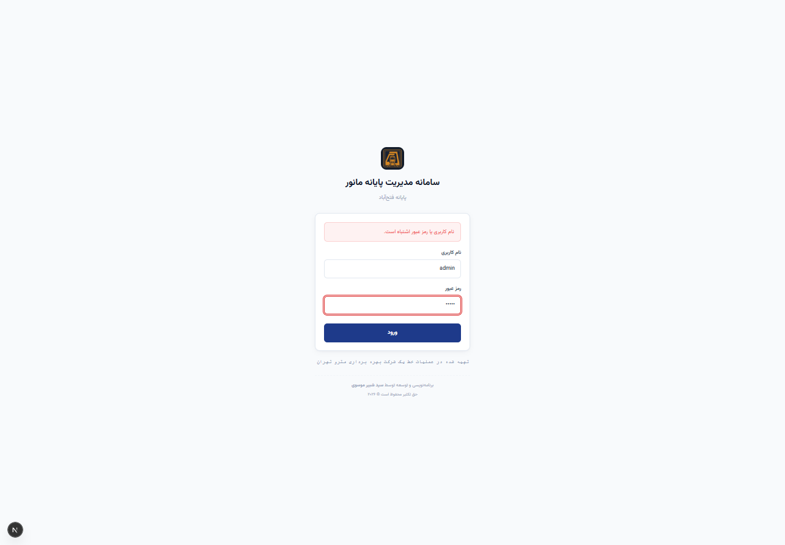

---

### گام ۲: نمای تعاملی دپو و مانیتورینگ جامع چیدمان ناوگان در خطوط (۲بعدی)

#### ۱. هدف و اهمیت عملیاتی:
این صفحه، هسته مرکزی و مانیتورینگ بصری پایانه فتح‌آباد است که موقعیت دقیق استقرار هر قطار، ظرفیت خطوط، خطوط مسدود و علائم فنی را در قالبی واضح و ارگونومیک به نمایش می‌گذارد.

#### ۲. کالبدشکافی زون‌ها و ساختار خطوط پایانه فتح‌آباد:
نقشه دوبعدی سامانه مطابق با استاندارد ایستگاهی و چیدمان واقعی خطوط در پایانه فتح‌آباد به بخش‌های مجزا تفکیک شده است:
* **پارکینگ جنوبی (خطوط ۱ تا ۲۵):** ظرفیت پارک قطارهای مسافری و آماده‌به‌کار خط یک.
* **پارکینگ شمالی (خطوط ۱ تا ۲۵):** خطوط پارک شبانه، آماده‌سازی و استقرار ناوگان اعزامی.
* **خط اصلی (سوله مرکزی):** دارای جایگاه‌های اصلی (۱ تا ۱۸) برای استقرار هم‌زمان قطارهای AC و دیزل‌های DC، به همراه بیش از ۷۰ جایگاه خالی با قابلیت اسکرول و پیمایش.
* **سوله واگن‌سازی (خطوط ۱ تا ۱۶):** خطوط اختصاصی تعمیرات سنگین، جک‌های بالابر، خط بادگیری و خط کور ۱.
* **دیزل‌شاپ (خطوط تخصصی):** شامل خط تست، خط D7G، باطری‌خانه، دیزل‌شاپ B1 و B2، کارخانه‌های ۱ و ۲ و ۳ جهت سرویس دیزل‌های مانوری.
* **خطوط فرعی ۱ و ۲:** خط کور ۲، آبگیری، پیت‌لاین، متروواش (شست‌وشوی مکانیزه ناوگان)، مجاور سوله و خطوط دوار شرقی و غربی.

#### ۳. سیستم نشانه‌گذاری رنگی و علائم ایمنی قطارها:
بر روی بدنه نشانگر هر قطار، کدهای رنگی و نمادهای استاندارد زیر قرار دارند:
* **رنگ سبز (آماده به کار):** قطار سالم، دارای تاییدیه فنی و آماده برای اعزام به خط اصلی مسافری.
* **رنگ نارنجی (تحت تعمیر):** قطار دارای خرابی در دست پیگیری توسط تکنسین‌های تعمیرات.
* **رنگ قرمز (غیرفعال / خراب):** قطار متوقف، دارای خرابی حاد یا فاقد شرایط سیر.
* **رنگ آبی (آماده اعزام):** قطار شسته شده، آزمایش ترمز انجام‌شده و برنامه‌ریزی‌شده جهت اعزام اول صبح.
* **نماد ⚡ (کفشک):** مشخص‌کننده قطارهایی که کفشک جریان‌گیر آن‌ها فعال یا فاقد کفشک است.
* **نماد 🚨 (عدم ATP):** هشدار بحرانی مبنی بر خاموش یا معیوب بودن سامانه حفاظت اتوماتیک قطار.
* **نماد 🔄 (دوار A/B/C):** نشانگر موعد فرارسیدن بازرسی‌های دوره‌ای مکانیزم دوار چرخ‌ها.
* **نماد 🛑 (بدون مجوز):** عدم صدور مجوز حرکت از سوی دیسپاچینگ یا ایمنی پایانه.

#### ۴. آموزش عملیاتی قابلیت ثبت مانور با کلیک (Modal Window):
* **نحوه اقدام:** با کلیک مستقیم ماوس بر روی هر خط ریل یا بر روی پلاک یک قطار، یک پنجره پاپ‌آپ شکیل (Modal) دقیقاً در مرکز صفحه باز می‌شود.
* **امکانات داخل مدال ریل:**
  - **تب اول (قطارهای مستقر):** فهرست دقیق قطارهای مستقر، شماره اسلات پارک و گزینه استقرار مستقیم قطار روی ریل برای ادمین.
  - **تب دوم (ثبت مانور جابه‌جایی):** انتخاب مستقیم قطار، انتخاب خط مقصد، انتخاب جایگاه پارک، دکمه سریع **«⚡ مانور در محل (ثبت روی همین خط)»**، تعیین نوع مانور و انتخاب راهبران با دکمه ذخیره فوری.
  - **تب سوم (انتقال سریع):** ویژه مسئولین ارشد پایانه جهت تصحیح سریع موقعیت قطار بدون ثبت گردش‌کار طولانی.
  - **دکمه مسدود کردن خط (🔴):** امکان بستن خط به دلیل تعمیرات ریل یا مانع فیزیکی؛ در این حالت خط به رنگ قرمز درآمده و سیستم اجازه انتقال قطار به آن خط را تا زمان بازگشایی مسدود می‌کند.

#### ۵. آموزش عملیاتی قابلیت هوشمند کشیدن و رها کردن (Drag & Drop):
* **نحوه اقدام:** کاربر می‌تواند نشان پلاک هر قطار را با کلیک چپ ماوس گرفته، آن را بکشد (Drag) و بر روی خط یا جایگاه ریل مقصد رها کند (Drop).
* **عملکرد هوشمند سیستم:**
  - سامانه در لحظه ظرفیت خط مقصد را ارزیابی می‌کند. اگر خط مقصد ظرفیت خالی نداشته باشد یا مسدود باشد، با خطای صوتی و تصویری از رهاسازی جلوگیری می‌نماید.
  - در صورت معتبر بودن خط، بلافاصله مدال ثبت مانور باز شده و فیلدهای **«قطار»**، **«خط مبدأ»** و **«خط مقصد»** به صورت خودکار تکمیل می‌گردند.
  - کاربر تنها کافی است نام راهبر ۱ و راهبر ۲ را انتخاب کرده و دکمه **«ثبت و اعمال نهایی مانور»** را بزند. با این مکانیزم، زمان ثبت هر مانور از ۲ دقیقه به کمتر از ۱۰ ثانیه کاهش می‌یابد.

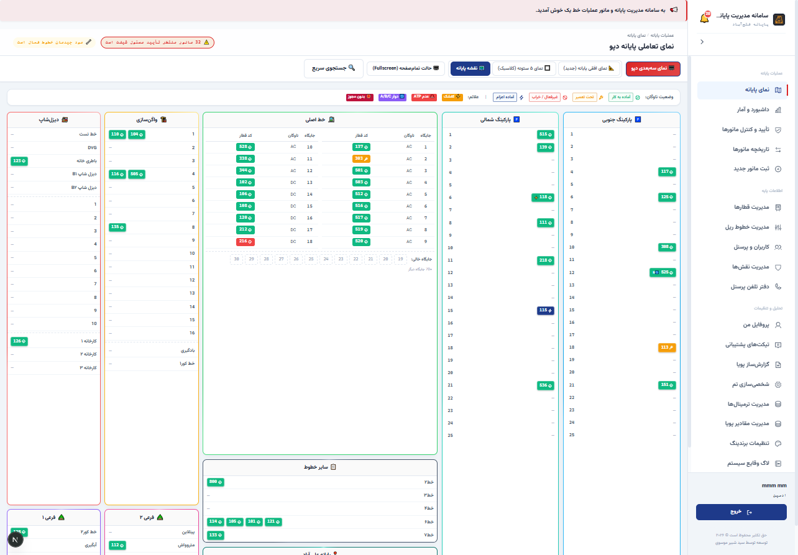

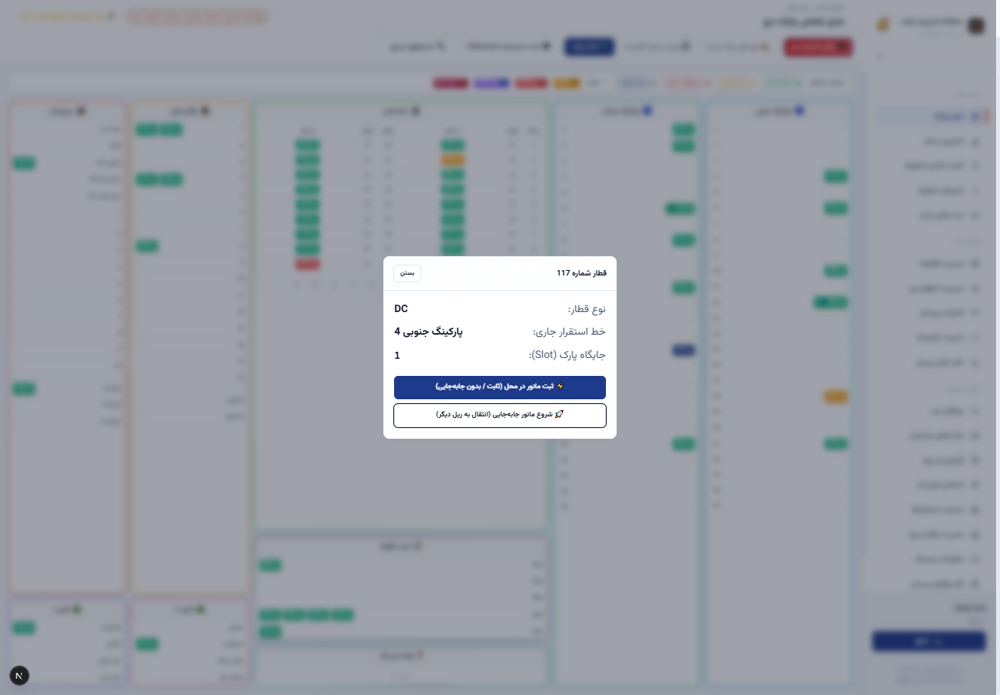

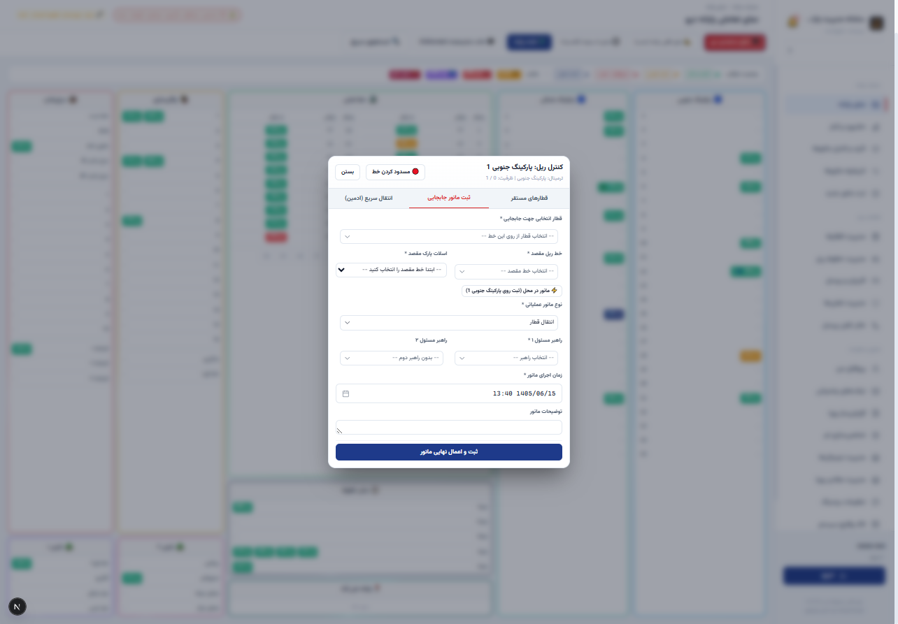

---

### گام ۳: نمای سه‌بعدی شبیه‌سازی‌شده پایانه دپو (3D Real-time Digital Twin)

#### ۱. هدف و اهمیت عملیاتی:
نمای سه‌بعدی به مدیران ارشد و ناظران اتاق کنترل امکان می‌دهد تا بدون حضور فیزیکی در پایانه وسیع فتح‌آباد، درک فضایی ملموس و دقیق از نحوه چینش قطارها، پر یا خالی بودن خطوط موازی و تراکم ناوگان در سوله‌ها به دست آورند.

#### ۲. نحوه فعال‌سازی و ناوبری با ماوس:
* با کلیک بر روی کلید **«🖥️ نمای سه‌بعدی دپو»** در نوار ابزار بالای نقشه، موتور سه‌بعدی WebGL فعال می‌گردد.
* **چرخش زاویه دید (Orbit / Rotate):** با نگه داشتن کلیک چپ ماوس و حرکت دادن نشانگر، می‌توان سوله را از زوایای ۳۶۰ درجه و از نمای هوایی (دید پرنده) یا افقی بررسی نمود.
* **جابه‌جایی دوربین (Pan):** با فشردن و نگه داشتن کلیک راست ماوس، زاویه دید دوربین در پهنه سوله به چپ، راست، بالا و پایین هدایت می‌شود.
* **بزرگ‌نمایی و کوچک‌نمایی (Zoom):** با چرخاندن غلتک ماوس (Scroll Wheel)، دوربین روی خطوط مشخص یا قطار خاص متمرکز می‌گردد.

#### ۳. بهینه‌سازی عملکردی در رایانه‌های اداری (Low-Poly Architecture):
سازه هندسی سوله، قطارها و ریل‌ها به صورت مدل‌های بهینه‌شده Low-Poly با حداقل مصرف منابع حافظه رم و گرافیک طراحی شده‌اند. این طراحی موجب می‌شود حتی در رایانه‌های اداری فاقد کارت گرافیک مجزا (با پردازنده‌های گرافیکی آنبورد اینتل)، چرخش و تعامل در محیط سه‌بعدی با نرخ فریم ۶۰ فریم بر ثانیه و کاملاً روان اجرا شود.

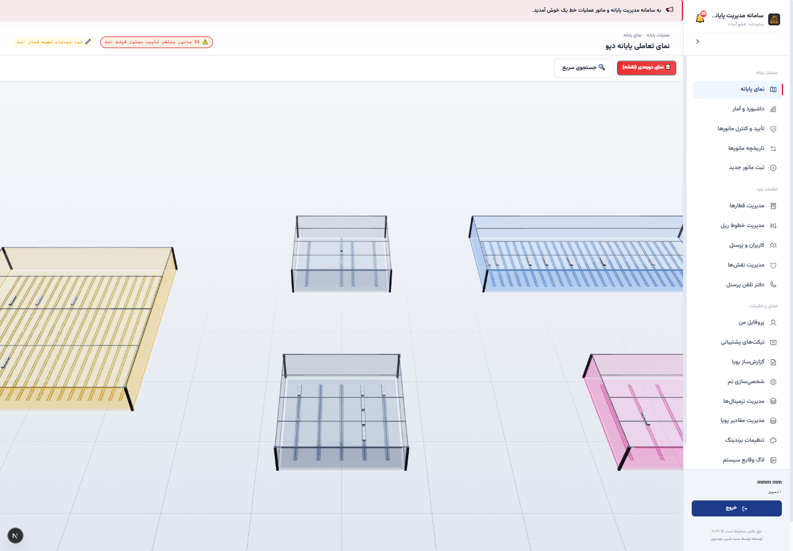

---

### گام ۴: داشبورد پایش آماری، کنترل عملیات و تابلوی اعلانات پایانه (Operations Dashboard)

#### ۱. هدف و اهمیت عملیاتی:
این بخش خلاصه وضعیت لحظه‌ای پایانه را به ارقام و نمودارهای مدیریتی تبدیل می‌کند و به مسئولین شیفت و مدیران خط کمک می‌کند تا در هر لحظه ظرفیت آزاد پایانه و میزان بار کاری را رصد کنند.

#### ۲. تحلیل کارت‌های آماری بالایی داشبورد:
* **تعداد کل خطوط (۱۰۴ خط):** مجموع کل خطوط تعریف‌شده در پایانه فتح‌آباد (شامل پارکینگ‌ها، سوله‌ها و خطوط فرعی).
* **خطوط اشغال‌شده (۲۴ خط):** تعداد خطوطی که در لحظه حاضر حداقل یک دستگاه قطار یا دیزل روی آن‌ها پارک شده است.
* **تعداد قطارهای فعال (۱۹۳ قطار):** ناوگان مسافری و خدماتی مستقر در دپو که آماده یا تحت فرآیند سرویس هستند.
* **مانورهای در جریان (۳۱ مانور):** جابه‌جایی‌هایی که توسط عوامل شیفت آغاز شده اما هنوز گزارش اتمام آن‌ها ثبت نگردیده است.
* **پرسنل شیفت حاضر (۸۵ نفر):** تعداد راهبران، سرپرستان و کارشناسان حاضر در نوبت کاری فعال.
* **کل مانورهای دوره (۳۸ مانور):** مجموع مانورهای ثبت‌شده از ابتدای نوبت کاری روز جاری.

#### ۳. کادر اعلام وضعیت بحرانی و مانورهای معوقه:
کادر برجسته قرمز رنگ در بالای داشبورد، تعداد مانورهایی را که نیازمند بررسی و تأیید نهایی توسط سرپرست شیفت هستند به صورت بلادرنگ هشدار می‌دهد. سرپرست شیفت با کلیک بر روی دکمه **«بررسی و تأیید»** مستقیماً به کارتابل تأییدات هدایت می‌شود تا هیچ جابه‌جایی تأییدنشده‌ای باقی نماند.

#### ۴. سیستم مخابره پیام و اطلاعیه‌های عملیاتی (Broadcast Announcement):
مدیریت پایانه می‌تواند از فرم اختصاصی این بخش، اطلاعیه‌های رسمی را برای تمامی کاربران آنلاین منتشر کند:
- **عنوان پیام:** مشخص کردن تیتر پیام (مثلاً: «اعلام شرایط لغزندگی خطوط به دلیل بارندگی»).
- **مخاطب پیام:** ارسال به همگان (Broadcast) یا شیفت کاری خاص (A, B, C).
- **نوع و شدت پیام:** اطلاعیه عمومی (آبی)، هشدار احتیاطی (زرد)، پیام فوری و بحرانی (قرمز).
- **متن اطلاعیه:** دستورالعمل و رهنمود عملیاتی لازم. به محض کلیک دکمه «ارسال و انتشار پیام»، این اطلاعیه در نوار بالای سامانه تمامی پرسنل شیفت نمایش داده می‌شود.

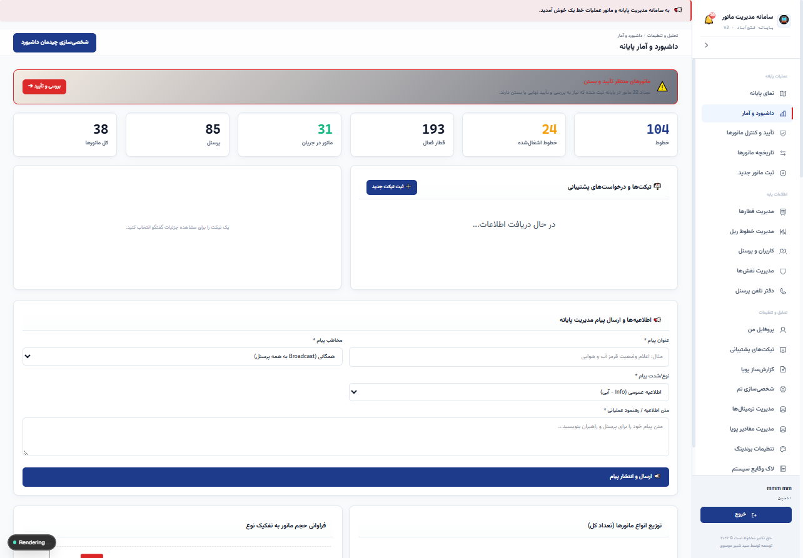

---

### گام ۵: فرم ثبت سریع مانور و مدیریت جابه‌جایی ناوگان (Maneuver Dispatching)

#### ۱. هدف و اهمیت عملیاتی:
هرگونه جابه‌جایی واگن، قطار یا لوکوموتیو دیزل در پایانه نیازمند ثبت رسمی با ذکر مبدأ، مقصد، عامل و زمان است تا ایمنی سیر تضمین شده و چرخه نگهداری قطار شفاف باشد.

#### ۲. فیلد به فیلد آموزش تکمیل فرم:
* **فیلد نوع مانور (*):** کاربر از فهرست کشویی، نوع عملیات را مشخص می‌کند:
  - *انتقال قطار:* جابه‌جایی عادی از پارکینگ به خط اعزام یا بالعکس.
  - *تعویض کفشک:* مانور جهت تعویض کفشک‌های سایش‌یافته جریان‌گیر.
  - *دیزل مانوری:* عملیات یدک‌کشی ناوگان فاقد برق توسط دیزل.
  - *شست‌وشو / متروواش:* هدایت قطار به دستگاه مکانیزه شست‌وشو.
  - *تراش چرخ / بادگیری / تست ترمز / آزمایش دوار.*
* **فیلد انتخاب قطار (*):** جستجو و انتخاب پلاک قطار برقی (AC) یا لوکوموتیو (DC).
* **گزینه کلیدی «مانور در محل (ثبت روی همان خط بدون جابه‌جایی قطار)»:**  
  در بسیاری از موارد، مانور فنی نظیر تعویض کفشک یا بازرسی فنی بر روی همان خطی که قطار پارک است انجام می‌شود و قطار حرکت فیزیکی ندارد. با تیک زدن این گزینه، سامانه خط مقصد را دقیقاً برابر با خط جاری قطار قرار داده و از بروز خطای کاربری جلوگیری می‌نماید.
* **فیلدهای خط مبدأ و خط مقصد (*):** انتخاب شماره خط شروع و خط پایان مانور.
* **فیلدهای راهبر مسئول ۱ و راهبر ۲ (کمکی):** تعیین هویت راهبر مجری مانور و همکار کمکی.
* **زمان اجرای مانور (*):** تاریخ و ساعت رسمی بر پایه تقویم شمسی جلالی و ساعت رسمی تهران که به صورت خودکار با زمان جاری تنظیم شده و در صورت نیاز قابل ویرایش است.
* **توضیحات تکمیلی:** ثبت دستورات ویژه یا علل مانور.

#### ۳. اعتبارسنجی‌ها و هشدارهای هوشمند سیستم:
- در صورت انتخاب خط مقصدی که مسدود است یا ظرفیت آن تکمیل شده باشد، فرم مانع از ذخیره‌سازی شده و پیام خطای فارسی صادر می‌کند.
- دکمه **«ثبت مانور»** بلافاصله پس از فشرده شدن، رکورد را در دیتابیس ثبت کرده و وضعیت قطار روی نقشه ۲بعدی و ۳بعدی را تغییر می‌دهد.

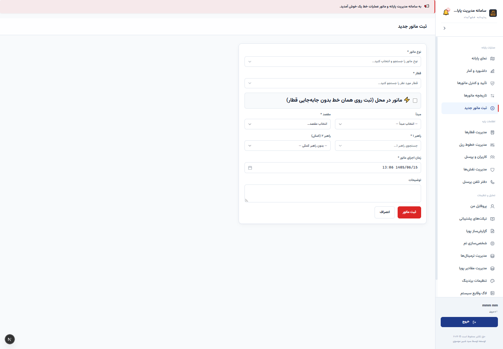

---

### گام ۶: سوابق، تاریخچه و فرآیند دو مرحله‌ای تأیید مانورها توسط سرپرست شیفت (Workflow Approvals)

#### ۱. هدف و اهمیت عملیاتی:
ثبت مانور به تنهایی کافی نیست؛ طبق مقررات راه‌آهن شهری، هر مانور باید پس از اتمام فیزیکی در پایانه، توسط راهبر یا سرپرست شیفت صحه‌گذاری و تأیید نهایی شود تا مسدودی خطوط آزاد شده و پرونده مانور بسته گردد.

#### ۲. ساختار جدول تاریخچه مانورها:
جدول این صفحه رکوردهای مانور را با ستون‌های زیر مرتب می‌کند:
* **کد مانور یکتا:** شناسه رهگیری رسمی (مانند ۱۴۷۲۷، ۱۴۷۲۶...).
* **نوع مانور و مسیر:** عنوان اقدام به همراه فلش حرکتی (مثلاً: «خط اصلی ➔ پارکینگ جنوبی ۴»).
* **قطار و راهبر:** پلاک ناوگان و نام کامل راهبر مسئول.
* **زمان اجرا و زمان ثبت سند:** تفکیک دقیق زمان انجام مانور در میدان از زمان ثبت در سامانه.
* **کاربر ثبت‌کننده:** مشخص بودن دقیق پرسنلی که فرم را در سیستم پر کرده است.
* **وضعیت اجرا:** نمایش برچسب زرد «شروع شده» برای مانورهای جاری، یا برچسب سبز «پایان‌یافته».
* **وضعیت تأییدیه:** مشخص بودن وضعیت «بدون تأیید» یا «تأییدشده توسط مسئول شیفت».

#### ۳. گردش کار اجرایی (Workflow Buttons):
* **دکمه «اتمام»:** راهبر یا مسئول محوطه پس از خاتمه مانور فیزیکی، این دکمه را می‌زند تا وضعیت به پایان‌یافته تغییر کند.
* **دکمه «تأیید»:** سرپرست شیفت پس از بررسی نهایی و اطمینان از استقرار ایمن قطار روی خط مقصد، این دکمه را کلیک می‌کند تا تأییدیه رسمی در لاگ ثبت گردد.
* **دکمه «حذف»:** منحصراً برای ادمین یا سرپرست ارشد در صورت ثبت رکوردهای اشتباه.

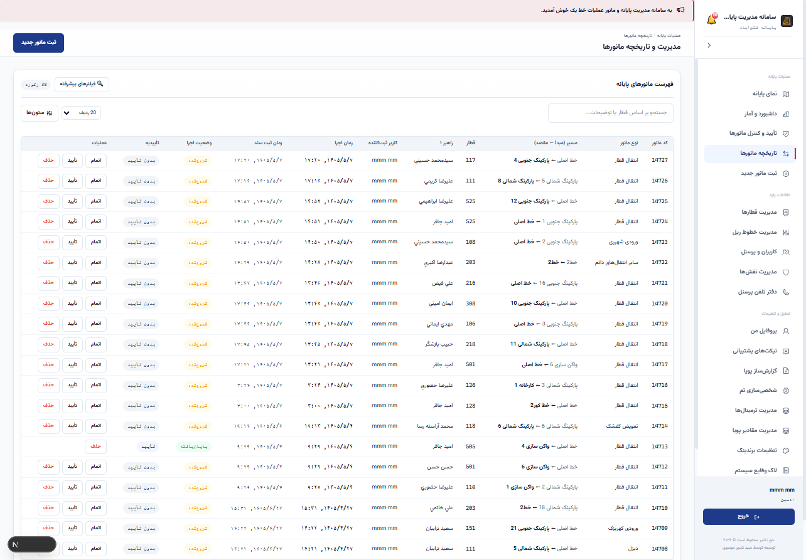

---

### گام ۷: شناسنامه جامع ناوگان و مدیریت وضعیت فنی قطارها و دیزل‌ها (Fleet Management)

#### ۱. هدف و اهمیت عملیاتی:
اطلاع از تعداد و سلامت قطارهای فعال، تفکیک قطارهای مسافری از لوکوموتیوها و رصد تجهیزات ایمنی سیر، پیش‌نیاز حیاتی برنامه‌ریزی اعزام قطارها به خط یک است.

#### ۲. کارت‌های آمار و تفکیک ناوگان پایانه:
* **۱۹۵ کل قطارها:** مجموع ناوگان ثبت‌شده در پایانه فتح‌آباد.
* **۱۵۱ قطار AC:** ناوگان مسافری خطوط مترو تغذیه‌شونده با برق بالاسری/ریل سوم.
* **۴۱ قطار/دیزل DC:** دیزل‌های مانوری و لوکوموتیوهای پشتیبانی پایانه.
* **۲ غیرفعال:** قطارهای متوقف جهت بازسازی یا در انتظار قطعات یدکی.

#### ۳. پایش و ویرایش لحظه‌ای مشخصات فنی:
در جدول قطارها، مسئولین می‌توانند با یک کلیک وضعیت تجهیزات را بدون باز کردن فرم‌های پیچیده تغییر دهند:
* **کفشک:** تغییر وضعیت از «کفشک‌دار» به «بدون کفشک».
* **سیستم ATP:** کلیک روی نشان ATP برای ثبت خرابی یا سلامت سیستم حفاظت قطار.
* **دوار A/B/C:** تعیین موعد بازرسی فنی دوره‌ای چرخ و بوژی.
* **وضعیت عملیاتی:** انتخاب بین حالت «آماده/استندبای»، «اعزام‌شده»، «تعمیرگاه» یا «مسدود».
* **مجوز سیر:** صدور یا ابطال مجوز حرکت قطار در محوطه پایانه.

#### ۴. ابزارهای تبادل داده اکسل (Excel Tools):
* **خروجی اکسل قطارها:** دریافت فایل اکسل کامل ناوگان جهت جلسات فنی با مدیران خط.
* **بارگذاری اکسل قطارها (Bulk Import):** امکان به‌روزرسانی مشخصات ده‌ها قطار به صورت هم‌زمان با آپلود فایل اکسل.
* **دانلود نمونه اکسل:** دریافت فایل الگوی آماده جهت پر کردن داده‌ها توسط مهندسی نگهداری و تعمیرات.

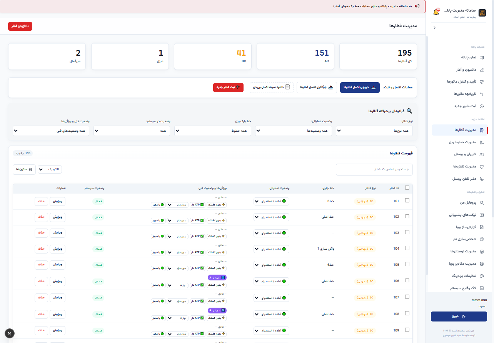

---

### گام ۸: موتور گزارش‌ساز پویا، تحلیلگر داده‌ها و خروجی‌های رسمی سازمانی (Analytics & Reports)

#### ۱. هدف و اهمیت عملیاتی:
مدیران عملیات نیازمند گزارش‌های دوره‌ای متنوعی هستند که فرمت ثابت ندارند. موتور گزارش‌ساز پویا به کاربران اجازه می‌دهد هر نوع گزارش تحلیلی، آماری یا کارنامه‌ای را بدون نیاز به برنامه‌نویسی استخراج نمایند.

#### ۲. قالب‌های گزارش پیش‌ساخته با یک کلیک:
سامانه دارای ۱۰ قالب استاندارد از پیش آماده است:
1. **تاریخچه مانورها:** گزارش کامل مانورهای ثبت‌شده با قابلیت فیلتر تاریخ شمسی.
2. **قطارهای مستقر در دپو:** لیست زنده قطارها به تفکیک خطوط و سوله‌های پارک.
3. **لیست قطارهای منلت‌شده (مثلث/متروواش):** پایش قطارهایی که نیازمند دور زدن در مثلث پایانه هستند.
4. **آمار ترافیک و تراکم خطوط:** تعداد جابه‌جایی‌ها به تفکیک هر خط ریل جهت شناسایی خطوط پرتردد.
5. **لیست قطارهای بادگیری‌شده:** گزارش ناوگانی که فرآیند بادگیری فیلترها و تجهیزات روی آن‌ها انجام شده است.
6. **مانورهای منتظر تأیید:** کارنامه موارد بلاتکلیف که تاییدیه سرپرست شیفت را دریافت نکرده‌اند.
7. **کارنامه عملکرد راهبران:** مجموع ساعات کار و تعداد مانورهای انجام‌شده توسط هر راهبر جهت پرداخت‌های کارانه‌ای.
8. **توزیع شیفت پرسنل:** آمار حضور عوامل اجرایی در شیفت‌های سه‌گانه (A, B, C).
9. **قطارهای اسقاطی / متوقف بلندمدت.**
10. **مانورهای امروز:** کارنامه عملکرد ۲۴ ساعت اخیر.

#### ۳. گزارش‌ساز سفارشی و شرطی (Query Builder):
* انتخاب موجودیت گزارش (مانورها، قطارها، پرسنل، خطوط).
* انتخاب ستون‌های دلخواه با تیک‌زدن (شناسه، قطار، مبدأ، مقصد، راهبر، زمان و...).
* تعریف فیلترهای شرطی پیشرفته (مانند: فقط قطارهای نوع DC که خط جاری آن‌ها واگن‌سازی است).

#### ۴. استانداردهای خروجی رسمی:
* **خروجی اکسل راست‌چین (RTL Excel):** تولید خودکار فایل XLSX که جهت شیت‌های آن از راست به چپ تنظیم شده و عناوین ستون‌ها کاملاً فارسی و خوانا هستند.
* **خروجی PDF رسمی فارسی:** تولید فایل PDF با تایپوگرافی رسمی و استفاده از فونت تعبیه‌شده وزیرمتن (Vazirmatn) بدون به هم ریختگی یا ناخوانایی حروف فارسی.
* **نمودارهای آماری:** قابلیت سوئیچ نمایش بین جدول، نمودار ستونی، دایره‌ای و خطی.

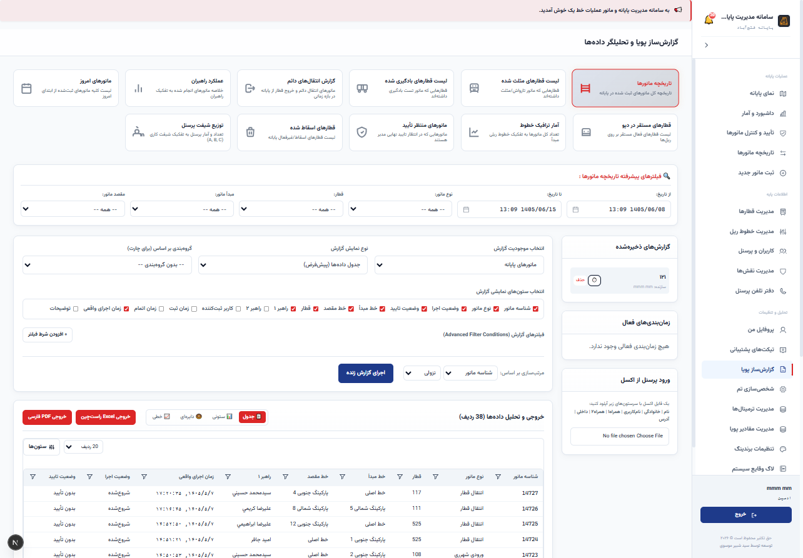

---

### گام ۹: مدیریت سطوح دسترسی، امنیت و تفکیک وظایف بر پایه نقش (Fine-Grained RBAC)

#### ۱. هدف و اهمیت عملیاتی:
جلوگیری از دستکاری سهوی داده‌ها و تضمین محرمانگی اطلاعات، نیازمند آن است که هر کاربر تنها به امکانات متناسب با سمت سازمانی خود دسترسی داشته باشد.

#### ۲. نقش‌های استاندارد سیستمی:
* **نقش ادمین (مدیر ارشد سامانه):** دسترسی تام به تمامی بخش‌ها، مدیریت کاربران، نقش‌ها، خطوط، تنظیمات برندینگ، بک‌آپ‌گیری و بازیابی پایگاه داده.
* **نقش مسئول (سرپرستان شیفت و مسئولین خط):** امکان ثبت و تأیید مانورها، تغییر خطوط و وضعیت ناوگان، مشاهده داشبورد و گزارش‌گیری.
* **نقش مشاهده (ویژه مدیران محترم خط و واحدهای نظارتی):** دسترسی به کلیه نقشه‌های ۲بعدی و ۳بعدی، داشبورد و خروجی‌های گزارش، **صرفاً جهت دیدن و پایش** بدون وجود دکمه‌های ویرایش یا تغییر داده‌ها. این سطح دسترسی به مدیران اجازه می‌دهد بدون نگرانی از به هم خوردن تنظیمات پایانه، وضعیت را مستمراً رصد کنند.
* **نقش بدون دسترسی / تعلیق:** برای کاربرانی که به مرخصی رفته یا حساب کاربری آن‌ها مسدود موقت شده است.

#### ۳. تعریف نقش‌های سفارشی با بیش از ۴۰ مجوز ریز:
مدیر سیستم می‌تواند نقش‌های جدیدی نظیر «سرپرست تعمیرات»، «دیسپاچر اعزام» یا «بازرس ایمنی» تعریف کرده و از میان فهرست جامع مجوزها، دسترسی‌های مشخصی (نظیر فقط مشاهده قطارها، فقط ثبت مانور، فقط صدور اکسل) را به آن نقش تخصیص دهد.

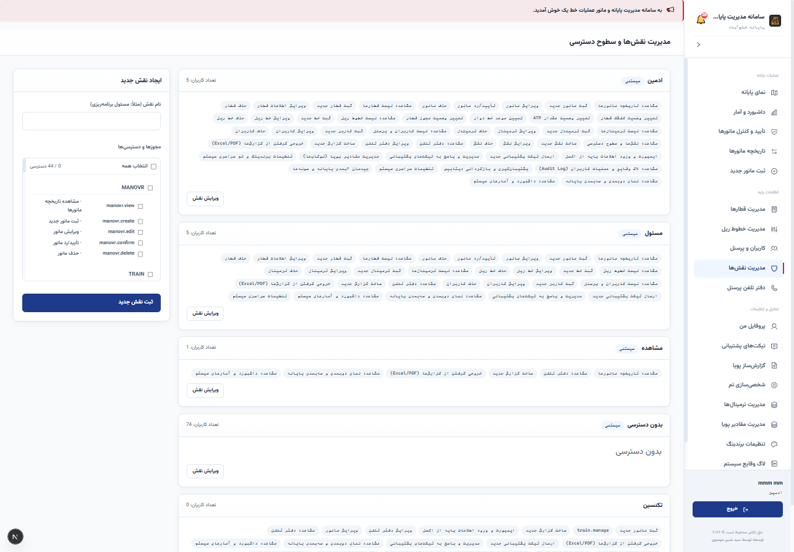

---

### گام ۱۰: لاگ وقایع امنیتی، ردگیری تغییرات و کارنامه عملیاتی (Audit Trail & Compliance)

#### ۱. هدف و اهمیت عملیاتی:
در تأسیسات حساسی چون متروی تهران، قابلیت ردگیری تصمیمات و اقدامات یک الزام پدافندی و نظارتی است. اگر قطاری جابه‌جا شود یا نقصی فنی ثبت گردد، باید مشخص باشد چه کسی در چه تاریخی و چه ساعتی این عمل را انجام داده است.

#### ۲. مشخصات و ستون‌های لاگ وقایع:
* **کد لاگ ترتیبی:** شناسه یکتا و افزایشی هر رویداد.
* **کاربر عامل:** نام و نام خانوادگی و شناسه پرسنلی کاربری که اقدام را انجام داده است.
* **موجودیت و شناسه رکورد:** مشخص شدن اینکه تغییر روی قطار (train)، مانور (manovr)، پرسنل یا نقش‌ها بوده است.
* **نوع اقدام:** ایجاد (Create)، ویرایش (Update) یا حذف (Delete).
* **شرح عملیات فارسی و خوانا:** به عنوان مثال: «مانور جدید برای قطار ۱۱۷ از خط اصلی به خط پارکینگ جنوبی ۴ ثبت گردید»، «رمز عبور کاربر توسط مدیر بازنشانی شد».
* **زمان دقیق ثبت:** تاریخ شمسی و زمان با دقت ثانیه.
* **دکمه «مشاهده جزئیات فیلدی»:** مقایسه مقادیر فیلدها قبل و بعد از تغییر (Old Value vs. New Value) برای شفافیت کامل در بررسی علل سوانح یا تأخیرات خط یک.

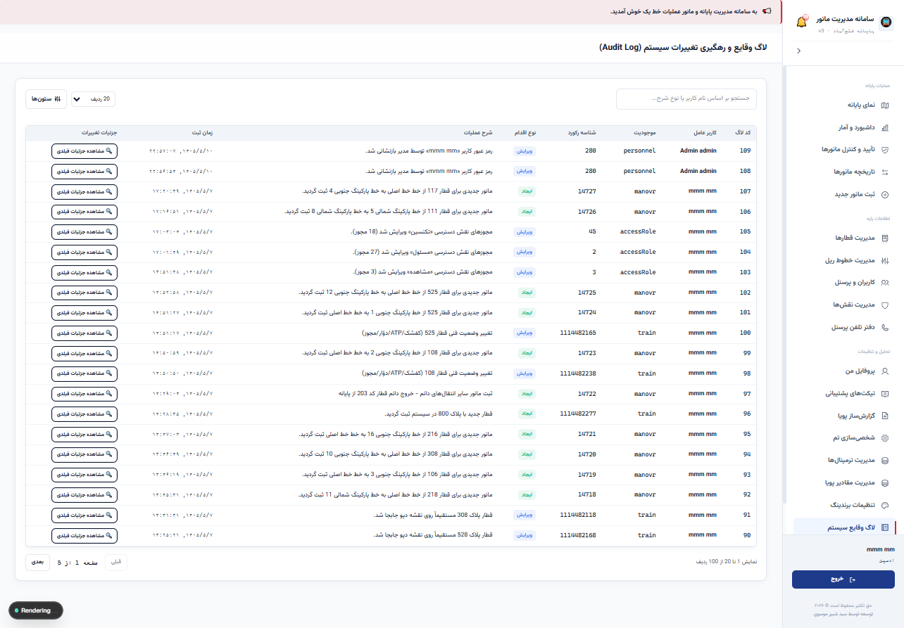

---

## ۳. مشخصات فنی عمیق، معماری نرم‌افزار و تکنولوژی‌ها

سامانه جامع دپو و مانور با بهره‌گیری از بروزترین پشته نرم‌افزاری پایدار سازمانی (Enterprise Full-Stack) توسعه یافته است:

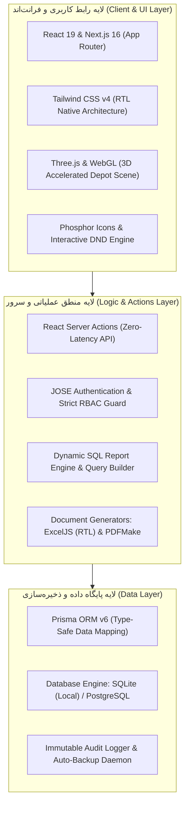

### جدول مشخصات دقیق فناوری‌های پروژه:

| مؤلفه سیستم | تکنولوژی / نسخه | خصوصیات و کارکرد تخصصی در سامانه |
| :--- | :--- | :--- |
| **هسته فرانت‌اند** | **Next.js 16.2.12 + React 19.2.4** | رندر ترکیبی سمت سرور و کلاینت، عملکرد لحظه‌ای و لود کمتر از نیم ثانیه |
| **زبان کدنویسی** | **TypeScript 5 (Strict Mode)** | جلوگیری از خطاهای زمان اجرا (Zero Runtime Type Error) و پایداری بالا |
| **طراحی ظاهری** | **Tailwind CSS v4** | ساختار بومی راست‌چین (RTL-First)، تم تاریک و روشن، طراحی شیشه‌ای مدرن |
| **رندر سه‌بعدی** | **Three.js 0.185 + React Three Fiber** | بازسازی سه‌بعدی خطوط و قطارها با شتاب‌دهنده سخت‌افزاری WebGL |
| **مدیریت پایگاه داده** | **Prisma ORM 6.19.3** | دسترسی یکپارچه و بهینه به دیتابیس با مدل رابطه‌ای کامل |
| **موتور پایگاه داده** | **SQLite (پیش‌فرض) / PostgreSQL** | فایل سبک و بهینه‌سازی‌شده برای شبکه SMB با ژورنالینگ TRUNCATE و کش ۳۲MB |
| **صدور فایل و اسناد** | **ExcelJS 4.4 + PDFMake 0.3** | ساخت فایل‌های رسمی اکسل راست‌چین و PDF فارسی با فونت استاندارد وزیرمتن |
| **بسته‌بندی کلاینت** | **ElectronJS 43.1** | امکان بسته‌بندی مستقیم در قالب فایل اجرایی ویندوز (`.exe`) بدون نیاز به نصب هیچ نرم‌افزار پیش‌نیاز |
| **به‌روزرسانی هوشمند** | **Non-installer Auto-Updater** | استقرار سبک پچ‌ها و باینری‌ها از پوشه اشتراکی سرور با بررسی هش یکپارچگی و بک‌آپ خودکار |
| **پایش زنده و شبکه** | **SSE Stream + Timeout Guard** | همگام‌سازی لحظه‌ای تغییرات دپو با دی‌بانس هوشمند و پایش سلامت اتصال شبکه بدون فریز سیستم |

---

## ۴. مرزهای عملکردی و الزامات پدافند غیرعامل و ایمنی مترو

برای تضمین حداکثر شفافیت و انطباق با مقررات بهره‌برداری راه‌آهن شهری، مرزهای عملکردی زیر در سیستم لحاظ شده است:

1. **عدم کنترل فیزیکی سوزن‌ها و ادوات سیگنالینگ ریل (No PLC/Interlocking Actuation):**  
   سامانه یک نرم‌افزار هدایت، پایش، برنامه‌ریزی و ثبت عملیاتی است. تغییر وضعیت فیزیکی سوزن‌های ریل منحصراً بر عهده سیستم اینترلاکینگ و سیگنالینگ ایستگاهی پایانه بوده و نرم‌افزار دپو هیچ فرمانی به ادوات سخت‌افزاری ریل ارسال نمی‌کند؛ لذا هیچ ریسک ناخواسته‌ای در ایمنی فیزیکی حرکت ایجاد نمی‌نماید.
2. **استقلال ۱۰۰٪ از اینترنت عمومی (Offline-First Capable):**  
   تمامی وابستگی‌ها، کتابخانه‌های جاوااسکریپت، فونت‌های فارسی و بسته‌های گرافیکی در داخل سیستم ذخیره شده‌اند. نرم‌افزار در شبکه‌های کاملاً ایزوله و فاقد اینترنت (Air-Gapped Network) بدون کوچک‌ترین نقصی کار می‌کند که این موضوع منطبق با الزامات سطح یک پدافند غیرعامل در زیرساخت‌های حمل‌ونقل شهری است.
3. **پایداری داده و پشتیبان‌گیری خودکار:**  
   سامانه مجهز به سیستم تهیه خودکار و دستی فایل پشتیبان (Backup) فشرده از دیتابیس و تنظیمات است که امکان بازیابی سامانه در کمتر از ۵ دقیقه را در شرایط بروز نقص سخت‌افزاری فراهم می‌آورد.

---

## ۵. دستورالعمل استقرار، نیازمندی‌های سخت‌افزاری و پیکربندی شبکه پایانه

### مشخصات سخت‌افزاری پیشنهادی:

| سخت‌افزار | حداقل سیستم مورد نیاز | سیستم پیشنهادی و بهینه |
| :--- | :--- | :--- |
| **پردازنده (CPU)** | Intel Core i3 (نسل ۶ به بالا) | Intel Core i5 / Core i7 یا Xeon سروری |
| **حافظه اصلی (RAM)** | ۴ گیگابایت | ۸ الی ۱۶ گیگابایت |
| **دیسک سخت (SSD)** | ۲۰ گیگابایت فضای خالی | ۵۰ گیگابایت حافظه پرسرعت NVMe SSD |
| **کارت شبکه (NIC)** | کارت شبکه 100Mbps | کارت شبکه 1Gbps متصل به سوییچ پایانه |
| **سیستم‌عامل سرور** | Windows 10/11 یا Windows Server | Windows Server 2022 یا Ubuntu Server 24.04 |
| **کلاینت کاربران** | هر رایانه متصل به شبکه داخلی | مرورگرهای استاندارد Google Chrome یا Edge |

### مراحل راه‌اندازی و تحویل به مدیریت عملیات:
1. **اختصاص رایانه یا سرور میزبان در پایانه فتح‌آباد:** نصب نرم‌افزار روی سرور مرکزی اتاق کنترل پایانه.
2. **تنظیم IP ثابت در شبکه داخلی (Static IP):** به عنوان مثال اختصاص آدرس `http://192.168.1.100:3000` در شبکه دپو.
3. **تعریف کاربران و نقش‌های اولیه:** ورود نام راهبران، سرپرستان شیفت‌ها (A, B, C) و تعیین دسترسی نظارتی برای مدیران ارشد خط یک.
4. **شروع بهره‌برداری پایلوت:** آغاز ثبت موازی مانورها به صورت دیجیتال و ارزیابی بازخوردهای عملیاتی.

---
**پایان سند راهنما و مشخصات فنی**
