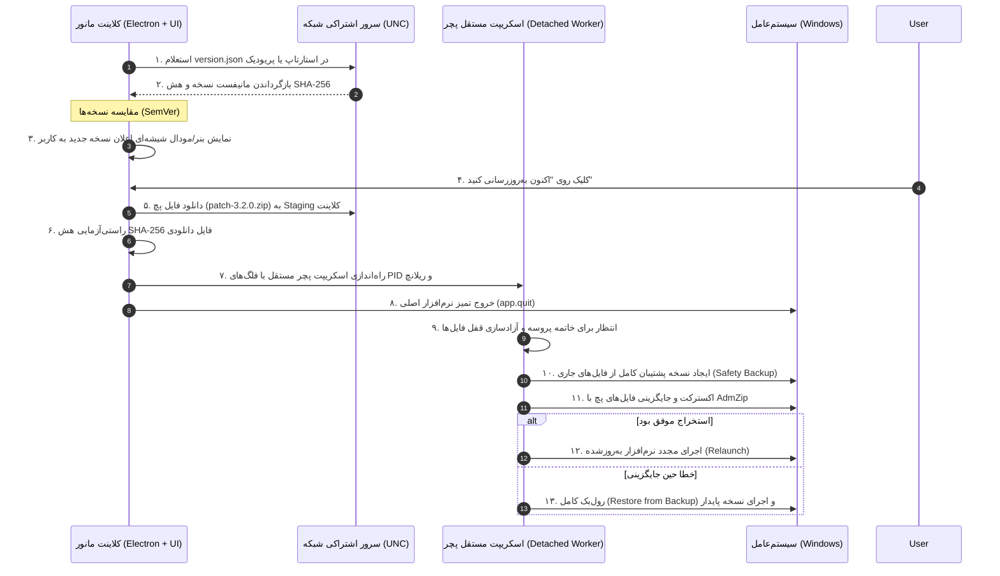

# معماری جامع پایپ‌لاین به‌روزرسانی خودکار بدون اینستالر (Non-Installer Auto-Update System)
## سامانه یکپارچه مدیریت مانور و ناوگان ریلی (Manovr V3)

> **طراح:** معمار ارشد سیستم‌های نرم‌افزاری و مهندس سامانه‌های Auto-Update  
> **محیط هدف:** ویندوز سازمانی (Windows Server / Windows 10/11 x64) بر بستر Electron + Next.js Standalone  
> **روش استقرار:** اشتراک شبکه محلی (UNC Network Share) بدون نیاز به ویزارد نصب یا پکیج‌های سنگین MSI/EXE

---

## ۱. نمای کلی و اهداف معماری (Executive Blueprint)

در محیط‌های عملیاتی سازمانی و شبکه‌های ایزوله راه‌آهن، استفاده از اینستالرهای سنگین (`.exe` یا `.msi`) با چالش‌هایی نظیر:
- نیاز به مجوزهای ادمین سیستم‌عامل (UAC Prompts) در هر بار نصب،
- از دست رفتن تنظیمات محلی و کانفیگ‌های ایستگاه،
- زمان‌بر بودن دانلود و قطعی‌های احتمالی شبکه،
- و نیاز به مداخله فیزیکی کاربر یا اپراتور مواجه است.

**راهکار معماری Manovr V3:** پیاده‌سازی یک خط لوله مدرن **پچینگ درجا (In-Place File/Binary Patching)** بر مبنای سرور فایل اشتراکی شبکه (`\\srvdfs01\Line1\Depo\updates`).



---

## ۲. مشخصات و شمای فایل مانیفست نسخه (`version.json`)

فایل `version.json` در ریشه پوشه اشتراکی شبکه مستقر می‌شود و شامل تمام اطلاعات اعتبارسنجی، نیازمندی‌ها، هش امنیتی و گزارش تغییرات به زبان فارسی است:

### ۲.۱. نمونه فایل تولید شده:
```json
{
  "version": "3.2.0",
  "releaseDate": "2026-09-15T08:30:00Z",
  "releaseDateJalali": "۱۴۰۵/۰۶/۲۵",
  "minSupportedVersion": "3.0.0",
  "packageType": "patch",
  "packageFile": "patches/patch-3.2.0.zip",
  "sha256": "e3b0c44298fc1c149afbf4c8996fb92427ae41e4649b934ca495991b7852b855",
  "fileSizeBytes": 1425840,
  "mandatory": false,
  "targetPlatform": "win-x64",
  "changelog": {
    "highlights": [
      "بهبود چشمگیر کارایی و نرخ فریم در نمای سه‌بعدی و دوبعدی دپو",
      "اضافه شدن سیستم همگام‌سازی و بازرسی خودکار در شبکه محلی"
    ],
    "features": [
      "پشتیبانی از فرمت‌های جدید کارت‌های سیر در ماژول مانور و تیکت‌ها",
      "امکان استخراج آنی گزارشات سفارشی در قالب Excel و PDF با فونت وزیرمتن"
    ],
    "fixes": [
      "رفع خطای اشتراک‌گذاری همزمان پایگاه داده SQLite بر روی UNC درایو شبکه",
      "اصلاح ناهماهنگی اعداد و تقویم شمسی در خروجی‌های پرینت"
    ],
    "breaking": []
  }
}
```

### ۲.۲. فیلدهای کلیدی:
- `packageType`: نوع پچ را مشخص می‌کند؛ `"patch"` فقط حاوی فایل‌های کامپایل‌شده تغییریافته (نظیر `.next/standalone` یا اسکریپت‌ها با حجم کم در حد چند مگابایت) است، در حالی که `"full"` در ارتقاهای اساسی نسخه ماژور ارسال می‌شود.
- `minSupportedVersion`: کنترل می‌کند که کلاینت فعلی امکان دریافت پچ دلتا را دارد یا نیاز به دریافت فول‌پکیج است.
- `sha256`: هش ۶۴ کاراکتری برای تضمین سلامت فیزیکی و امنیتی پچ قبل از اعمال.

---

## ۳. منطق سمت کلاینت بررسی نسخه (Client-Side Version Checker)

کد ماژولار در مسیر [`src/lib/auto-updater/version-checker.ts`](file:///d:/Manovr/manovr-v2/src/lib/auto-updater/version-checker.ts) پیاده‌سازی شده است:

```typescript
// مقایسه نسخه‌ها بدون کتابخانه‌های سنگین خارجی
export function compareSemVer(v1: string, v2: string): number {
  const [major1, minor1, patch1] = parseSemVer(v1);
  const [major2, minor2, patch2] = parseSemVer(v2);

  if (major1 !== major2) return major1 > major2 ? 1 : -1;
  if (minor1 !== minor2) return minor1 > minor2 ? 1 : -1;
  if (patch1 !== patch2) return patch1 > patch2 ? 1 : -1;
  return 0;
}
```

- **مسیر شبکه هوشمند**: مسیر پوشه آپدیت مستقیماً از کانفیگ مرکزی `manovr-config.json` خوانده می‌شود (`sharedUpdatePath` یا پوشه مجاور `sharedDataPath`).
- **تحمل خطای شبکه (Fail-Safe)**: در صورتی که سرور شبکه قطع باشد یا فایل مانیفست در دسترس نباشد، برنامه بدون هیچ‌گونه توقف یا ایجاد مزاحمت برای کاربر به کار عادی خود ادامه می‌دهد.

---

## ۴. رابط کاربری اعلان و نوتیفیکیشن (Glassmorphism & RTL UI)

کامپوننت واکنش‌گرا و مدرن در مسیر [`src/components/auto-update/UpdateNotificationModal.tsx`](file:///d:/Manovr/manovr-v2/src/components/auto-update/UpdateNotificationModal.tsx) طراحی شده است:

### ویژگی‌های طراحی:
1. **راست‌چین کامل (`dir="rtl"`)** با فاصله‌گذاری و فونت زیبای وزیرمتن.
2. **استایل Glassmorphism ممتاز**: استفاده از لایه‌های شیشه‌ای تیره (`bg-slate-900/85 backdrop-blur-2xl border border-slate-700/60`).
3. **تفکیک تب‌های تغییرات**: دسته‌بندی امکانات جدید، رفع باگ‌ها و نکات کلیدی نسخه.
4. **نوار پیشرفت زنده (Live Progress Bar)**: نمایش درصدهای دانلود، اعتبارسنجی هش و آماده‌سازی پچ به صورت بلادرنگ.
5. **رفتار اختیاری یا اجباری**: در آپدیت‌های عادی کاربر دکمه «یادآوری در ورود بعدی» را در اختیار دارد، اما در آپدیت‌های ضروری (`mandatory: true`) سیستم کاربر را به ارتقا ملزم می‌سازد.

---

## ۵. موتور تعویض فایل‌ها و حل معضل قفل باینری‌ها در ویندوز (The Patching Engine)

### چالش قفل فایل در ویندوز (Windows File-Lock Issue):
هنگامی که یک فایل اجرایی (`.exe`) یا ماژول‌های نود فعال هستند، ویندوز اجازه بازنویسی مستقیم آن‌ها را نمی‌دهد (`EBUSY: resource busy or locked`).

### راهکار تخصصی پچر مجزا (Detached Worker Pattern):
ما فرآیند تعویض فایل را به یک پروسه مستقل سیستم‌عامل محول کرده‌ایم ([`scripts/updater/apply-patch.js`](file:///d:/Manovr/manovr-v2/scripts/updater/apply-patch.js)):

1. **دانلود امن به Staging**: پچ ابتدا در مسیر موقت کلاینت (`%LOCALAPPDATA%\ManovrSystem\updates\staging`) ذخیره می‌شود.
2. **بررسی هش امنیتی SHA-256**:
   ```typescript
   const calculatedHash = await calculateFileSha256(localTargetFile);
   if (calculatedHash !== manifest.sha256.toLowerCase()) {
     // انصراف آنی و حذف فایل مشکوک یا ناقص
   }
   ```
3. **اسپاون پروسه مستقل و خروج برنامه**:
   ```typescript
   const child = spawn(process.execPath, [
     updaterScriptPath,
     '--patch', patchZipPath,
     '--targetDir', appDir,
     '--backupDir', backupDir,
     '--waitPid', process.pid.toString(),
     '--relaunch', relaunchExePath,
     '--version', targetVersion
   ], { detached: true, stdio: 'ignore' });
   child.unref();
   app.quit();
   ```
4. **انتظار برای خروج PID والد**: پچر با دستور `process.kill(pid, 0)` تا آزادسازی کامل فایل‌ها منتظر می‌ماند.
5. **پشتیبان‌گیری اضطراری (Backup Snapshot)**: پوشه جاری کپی می‌شود.
6. **جایگزینی درجا با AdmZip**: پچ استخراج و روی فایل‌های برنامه می‌نشیند.
7. **اجرای مجدد نرم‌افزار**: نرم‌افزار به صورت خودکار بالا آمده و لاگ موفقیت در `patch-audit.log` درج می‌شود.

---

## ۶. استراتژی مدیریت خطا، قطعی شبکه و بازگشت به عقب (Rollback & Fallback)

| سناریوی خطا | علت محتمل | راهکار دفاعی و خودکار سیستم |
|---|---|---|
| **قطع شبکه حین دانلود** | افت اتصال وای‌فای/کابل LAN | دانلود استریم لغو شده، فایل ناقص پاک می‌شود و به کاربر خطای شفاف فارسی نمایش داده می‌شود؛ نرم‌افزار بدون مشکل به کار خود ادامه می‌دهد. |
| **عدم تطابق هش SHA-256** | انتقال ناقص یا دستکاری فایل در سرور | پچر فایل را رد کرده، آن را حذف می‌کند و اجازه اجرای کد نامعتبر را نمی‌دهد. |
| **خطای دسترسی درایو اشتراکی** | پرمیشن Read-only یا احراز هویت دامین | بررسی اولیه دسترسی‌ها (`try/catch`) مانع کرش شده و دسترسی فقط‌خواندنی شبکه برای دانلود کافی است. |
| **خرابی حین اکسترکت پچ** | خطای دیسک یا فضای ناکافی | فرآیند Rollback فورا تمام فایل‌های پشتیبان `backupDir` را به دایرکتوری اصلی بازمی‌گرداند و نسخه قبلی را بدون کرش مجدداً راه‌اندازی می‌کند. |

---

## ۷. فایل‌های پیاده‌سازی شده در پروژه

1. [`src/lib/auto-updater/types.ts`](file:///d:/Manovr/manovr-v2/src/lib/auto-updater/types.ts): تعاریف تایپ‌ها و اسکیماهای اعتبارسنجی Zod
2. [`src/lib/auto-updater/version-checker.ts`](file:///d:/Manovr/manovr-v2/src/lib/auto-updater/version-checker.ts): موتور بررسی نسخه و مقایسه SemVer
3. [`src/lib/auto-updater/patch-engine.ts`](file:///d:/Manovr/manovr-v2/src/lib/auto-updater/patch-engine.ts): استریم دانلود، اعتبارسنجی هش و راه‌اندازی فرآیند مجزا
4. [`scripts/updater/apply-patch.js`](file:///d:/Manovr/manovr-v2/scripts/updater/apply-patch.js): ورکر مستقل تعویض فایل‌ها و رول‌بک
5. [`src/components/auto-update/UpdateNotificationModal.tsx`](file:///d:/Manovr/manovr-v2/src/components/auto-update/UpdateNotificationModal.tsx): کامپوننت UI با طراحی شیشه‌ای و RTL
6. [`docs/auto-update/version.json`](file:///d:/Manovr/manovr-v2/docs/auto-update/version.json): نمونه ساختار استاندارد مانیفست سرور
7. [`src/lib/__tests__/auto-updater.test.ts`](file:///d:/Manovr/manovr-v2/src/lib/__tests__/auto-updater.test.ts): تست‌های واحد اعتبارسنجی با Vitest (پاس شده ۱۰۰٪)
