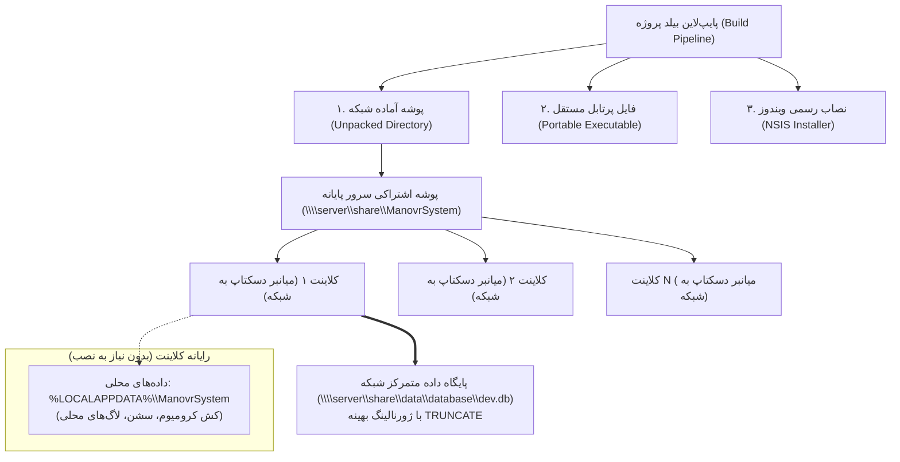

# راهنمای جامع بسته‌بندی، توزیع سه‌گانه و استقرار سامانه Manovr V3 تحت شبکه
## دستورالعمل فنی معمار بیلد و استقرار برای پوشه‌های اشتراکی شبکه (SMB / DFS / UNC)

---

> **عنوان سند:** راهنمای مهندسی بیلد، بسته‌بندی چندگانه و استقرار بدون نصاب بر روی شبکه فایل‌سرور  
> **نسخه مستند:** ۱.۰.۰ — شهریور ۱۴۰۵ (سپتامبر ۲۰۲۶)  
> **مخاطبان هدف:** مهندسین DevOps، مدیران زیرساخت شبکه و سرور، راهبران فنی پایانه فتح‌آباد، کارشناسان پشتیبانی نرم‌افزار  
> **فناوری‌های پایپ‌لاین:** Electron 43, Electron Builder 26, Next.js 16 (Standalone), PowerShell 7 / Windows CMD  

---

## ۱. مبانی معماری و اهداف استقرار تحت شبکه (Architecture Overview)

در محیط‌های عملیاتی و زیرساخت‌های حساس حمل‌ونقل ریلی (مانند پایانه فتح‌آباد متروی تهران)، استقرار نرم‌افزار بر روی ده‌ها رایانه ایستگاه‌های کاری با چالش‌های جدی مواجه است:
1. عدم دسترسی کاربران عادی به مجوزهای Administrator برای نصب نرم‌افزار بر روی سیستم‌های کلاینت.
2. اتلاف وقت در به‌روزرسانی تک‌تک رایانه‌ها هنگام ارائه نگارش‌های جدید.
3. خطای تاخیر اکسترکت در فایل‌های پرتابل فشرده سنتی هنگامی که باینری از روی کابل شبکه LAN لود می‌شود (Cold-Start Latency).
4. تصادم چندکاربره (Multi-User Collisions) و قفل شدن فایل‌های کش یا دیتابیس هنگامی که چند نفر همزمان یک فایل اجرایی را از روی شبکه باز می‌کنند.

برای رفع ریشه‌ای این موانع، سامانه **Manovr V3** به یک **پایپ‌لاین بیلد و استقرار سه‌گانه (Tri-Target Packaging Pipeline)** مجهز شده است که همزمان سه قالب توزیع بهینه‌شده تولید می‌کند.



---

## ۲. کالبدشکافی قالب‌های سه‌گانه توزیع (Distribution Formats)

| قالب توزیع | مسیر و نام فایل تولیدی | مخاطب و سناریوی کاربرد | مزیت فنی کلیدی |
| :--- | :--- | :--- | :--- |
| **۱. پوشه استخراج‌شده آماده شبکه (Unpacked Directory)** | `export/ManovrSystem/` یا `D:/manovr-build-dist/win-unpacked/` | **استقرار متمرکز روی فایل‌سرور شبکه دپو** جهت دسترسی کلیه کلاینت‌ها بدون نصب | **سرعت راه‌اندازی کمتر از ۱ ثانیه**، صفر شدن تاخیر اکسترکت، عدم اشغال هارد کلاینت |
| **۲. فایل پرتابل بهینه‌شده (Ultra-Optimized Portable)** | `export/ManovrSystem 0.1.0.exe` | **فلش‌مموری، سیستم‌های سیار کشیک، تبلت‌های ویندوزی و شرایط بحران** | تک‌فایل کاملاً مستقل، بدون نیاز به ادمین (`requestExecutionLevel: user`) |
| **۳. نصاب رسمی استاندارد ویندوز (Standard Installer)** | `export/ManovrSystem Setup 0.1.0.exe` | **رایانه‌های مرکزی و پایدار اتاق کنترل دپو** | ثبت رسمی در منوی استارت و دسکتاپ، امکان ارتقای خودکار، بدون نیاز به مجوز ادمین |

---

## ۳. معماری تفکیک داده‌ها و پیشگیری از قفل شبکه (Data Decoupling Engine)

یکی از مرگبارترین خطاهای استقرار الکترون بر روی شبکه اشتراکی، **قفل کرومیوم (Chromium SingletonLock)** است:
به صورت پیش‌فرض، اگر فایل اجرایی روی مسیر شبکه قرار داشته باشد و چند کاربر آن را باز کنند، کرومیوم سعی می‌کند فایل `SingletonLock` را در کنار فایل اجرایی بنویسد. در نتیجه اولین کاربر موفق شده و نفرات بعدی کرش کرده یا سیستم آن‌ها فریز می‌شود.

### راهکار پیاده‌سازی شده در `main.js`:
در همان خطوط نخست پروسه اصلی الکترون (پیش از فراخوانی هر وب‌کانتکست)، مسیرهای زیر به صورت کاملاً محلی ایزوله می‌شوند:

```javascript
// تفکیک قطعی مسیر داده‌های کلاینت از پوشه شبکه
const localAppDataRoot = process.env.LOCALAPPDATA || path.join(os.homedir(), 'AppData', 'Local');
const clientUserDataDir = path.join(localAppDataRoot, 'ManovrSystem');

app.setPath('userData', clientUserDataDir);
app.setPath('sessionData', path.join(clientUserDataDir, 'Session'));
app.setPath('crashDumps', path.join(clientUserDataDir, 'Crashpad'));
```

#### نتایج مستقیم این تفکیک:
1. **امکان اجرای همزمان بی‌نهایت کاربر:** صدها کاربر می‌توانند به طور همزمان فایل `ManovrSystem.exe` را از یک پوشه اشتراکی شبکه اجرا کنند بدون کوچک‌ترین تصادمی.
2. **محافظت از پهنای باند شبکه LAN:** کش‌های گرافیکی WebGL، شیدرها، فونت‌ها و حافظه موقت محلی می‌مانند و شبکه با بایت‌های بیهوده اشغال نمی‌شود.
3. **پایگاه داده متمرکز امن:** پایگاه داده مشترک ریلی بر اساس تنظیمات `manovr-config.json` در مسیر شبکه (`\\srvdfs01\Line1\Depo\data\database\dev.db`) باقی مانده و با پراگماهای بهینه‌شده `TRUNCATE` و تایم‌اوت ۶۰ ثانیه‌ای، تراکنش‌ها را بدون خطا پردازش می‌کند.

---

## ۴. رفع چالش خطای مسیرهای UNC در دایرکتوری کاری (CWD) ویندوز

ویندوز به صورت پیش‌فرض اجازه نمی‌دهد پروسه‌های فرزند یا CMD مسیرهای شبکه UNC (مانند `\\server\share`) را به عنوان مسیر جاری (`current working directory`) تنظیم کنند.  
در صورتی که این مورد مهار نشود، هنگام اجرای برنامه سرور Next.js با خطای زیر متوقف می‌شود:
```
CMD.EXE was started with the above path as the current directory.
UNC paths are not supported. Defaulting to Windows directory.
```

### معماری حل مسئله در Manovr V3:
1. **در سطح کد هسته (`main.js`):** چنانچه `serverCwd` با `\\` شروع شود، پردازه بلافاصله مسیر کاری را به پوشه امن محلی `%LOCALAPPDATA%\ManovrSystem` شیفت می‌دهد.
2. **در سطح میانبر کلاینت (`create-client-shortcut.ps1`):** فیلد `WorkingDirectory` میانبر به جای مسیر شبکه، مستقیماً به دایرکتوری امن محلی کلاینت (`%LOCALAPPDATA%\ManovrSystem`) ارجاع داده می‌شود.

---

## ۵. راهنمای گام‌به‌گام استقرار فوق‌سریع در پایانه فتح‌آباد

### مرحله اول: اجرای بیلد سازمانی روی سیستم توسعه/بیلد
کافی است یکی از دستورات زیر را در ریشه پروژه اجرا فرمایید:

```bash
# تولید همزمان هر ۳ قالب توزیع + بهینه‌سازی حجم + آماده‌سازی پکیج شبکه
npm run package:all
```
یا تولید مجزای هر قالب:
```bash
# فقط پوشه استخراج‌شده آماده شبکه (سریع‌ترین بیلد):
npm run package:unpacked

# فقط فایل پرتابل تک‌فایلی:
npm run package:portable

# فقط فایل نصبی ویندوز:
npm run package:installer
```

خروجی‌های آماده به صورت خودکار در پوشه `export/` پروژه با ساختار زیر تحویل داده می‌شوند:
```
export/
├── ManovrSystem/                  <-- پوشه کامل و استخراج‌شده آماده استقرار در شبکه
│   ├── ManovrSystem.exe
│   ├── resources/
│   ├── manovr-config.json
│   ├── create-client-shortcut.ps1
│   └── create-client-shortcut.bat
├── data/
│   └── database/
│       └── dev.db                 <-- پایگاه داده مرکزی شبکه اولیه
├── manovr-config.json             <-- کانفیگ پیش‌فرض مسیر شبکه
├── create-client-shortcut.ps1     <-- اسکریپت پاورشل ساخت شورتکات کلاینت
├── create-client-shortcut.bat     <-- لانچر یک‌کلیکه ساخت شورتکات
├── ManovrSystem Setup 0.1.0.exe   <-- نصاب استاندارد ویندوز
├── ManovrSystem 0.1.0.exe         <-- فایل پرتابل مستقل
└── ManovrSystem-v0.1.0-Unpacked.zip <-- آرشیو زیپ پوشه شبکه جهت جابجایی
```

---

### مرحله دوم: کپی روی فایل‌سرور پایانه (File Server Deployment)
پوشه `export/ManovrSystem` و پوشه `export/data` و فایل `manovr-config.json` را به پوشه اشتراکی شبکه سرور منتقل فرمایید:
```
\\srvdfs01\Line1\Depo\
├── ManovrSystem\                  <-- حاوی فایل‌های برنامه
├── data\                          <-- حاوی دیتابیس و لاگ‌های سرور
└── manovr-config.json
```

#### تنظیم مجوزهای امنیتی ویندوز سرور (NTFS & Share Permissions):
- **پوشه `ManovrSystem` (باینری‌های نرم‌افزار):**
  - اشتراک‌گذاری (Share): `Read` برای گروه `Domain Users` یا کاربران پایانه.
  - امنیت (NTFS): `Read & Execute` (فقط خواندنی؛ جهت ممانعت از دستکاری یا ویروسی شدن فایل‌های اجرایی).
- **پوشه `data` (پایگاه داده و لاگ‌ها):**
  - اشتراک‌گذاری (Share): `Change` یا `Full Control`.
  - امنیت (NTFS): `Modify` (اجازه خواندن و نوشتن فایل پایگاه داده `dev.db`).

---

### مرحله سوم: اتصال کلاینت‌ها (Client Setup)
روی سیستم هر یک از کاربران پایانه (اتاق کنترل، شیفت، راهبران):

1. وارد مسیر شبکه زیر شوید:
   `\\srvdfs01\Line1\Depo\ManovrSystem`
2. روی فایل **`create-client-shortcut.bat`** دوبار کلیک فرمایید.
3. یک میانبر رسمی با عنوان **«سامانه مدیریت مانور دپو»** همراه با آیکون اختصاصی بر روی دسکتاپ ویندوز کاربر ایجاد می‌گردد.
4. با کلیک روی میانبر، نرم‌افزار با سرعت آنی (زیر ۱ ثانیه) باز شده و آماده بهره‌برداری است.

---

## ۶. مشخصات و فلگ‌های بهینه‌ساز تعبیه‌شده در میانبر کلاینت

اسکریپت `create-client-shortcut.ps1` میانبر دسکتاپ را با پارامترهای فنی زیر پیکربندی می‌کند:

```powershell
$shortcut.TargetPath = "\\srvdfs01\Line1\Depo\ManovrSystem\ManovrSystem.exe"
$shortcut.WorkingDirectory = "$env:LOCALAPPDATA\ManovrSystem"
$shortcut.Arguments = "--disable-gpu-sandbox --no-sandbox --disable-background-networking --disable-features=RendererCodeIntegrity --js-flags=""--max-old-space-size=1024"""
```

| پارامتر / فلگ | نقش فنی در پایداری و کارایی شبکه |
| :--- | :--- |
| **`WorkingDirectory`** | ارجاع به هارد محلی کاربر جهت رفع قطعی خطای عدم پشتیبانی ویندوز از مسیرهای UNC در پروسه‌ها |
| **`--disable-gpu-sandbox`** | جلوگیری از فریز و کرش گرافیکی در کارت‌های گرافیک آنبورد (Intel HD Graphics) اداری |
| **`--disable-background-networking`** | قطع ترافیک‌های غیرضروری پس‌زمینه کرومیوم برای حفظ پهنای باند شبکه LAN |
| **`--max-old-space-size=1024`** | تثبیت سقف مصرف رم کلاینت روی ۱ گیگابایت جهت پایداری سیستم‌های اداری با ۴ گیگابایت رم |

---

## ۷. استقرار خودکار سازمانی از طریق اکتیودایرکتوری (GPO Deployment)

در صورت تمایل مدیران فناوری اطلاعات به ایجاد خودکار میانبر برای تمامی رایانه‌های دامین بدون مراجعه حضوری:
می‌توان اسکریپت `create-client-shortcut.ps1` را در مسیر **Group Policy Logon Script** قرار داد:
```
User Configuration -> Windows Settings -> Scripts (Logon/Logoff) -> Logon -> PowerShell Scripts
```
با این تنظیم، به محض ورود هر کاربر به ویندوز در شبکه دپو، میانبر سامانه به صورت کاملاً خودکار روی دسکتاپ ظاهر خواهد شد.

---

## ۸. چک‌لیست عیب‌یابی و ممیزی سلامت استقرار شبکه

| نشانه یا پیام خطا | علت محتمل | راهکار قطعی رفع اشکال |
| :--- | :--- | :--- |
| **خطای `SQLITE_BUSY` یا `database is locked`** | استفاده از حالت DELETE ژورنالینگ یا نبود مجوز نوشتن روی پوشه `data` | بررسی فایل `prisma.ts` (تنظیم بودن `TRUNCATE`) و اعطای مجوز Modify به کاربر روی پوشه `data` |
| **باز نشدن برنامه در کلاینت دوم** | تداخل پوشه `userData` در مسیر اشتراکی | اطمینان از قرارگیری کدهای تفکیک دایرکتوری در نسخه جدید `main.js` |
| **تاخیر ۱۰ الی ۲۰ ثانیه‌ای در لود اولیه** | استفاده از فایل پرتابل فشرده سنتی بر روی شبکه | استفاده از **پوشه بازشده `ManovrSystem`** به جای فایل فشرده جهت حذف زمان استخراج |
| **خطای UNC Path not supported** | تنظیم بودن Working Directory میانبر بر روی مسیر شبکه | اجرای اسکریپت `create-client-shortcut.bat` جهت تصحیح WorkingDirectory به مسیر محلی |

---
**تدوین شده توسط تیم معمار ارشد سیستم‌های بیلد، انتشار و استقرار شبکه — Manovr V3**
