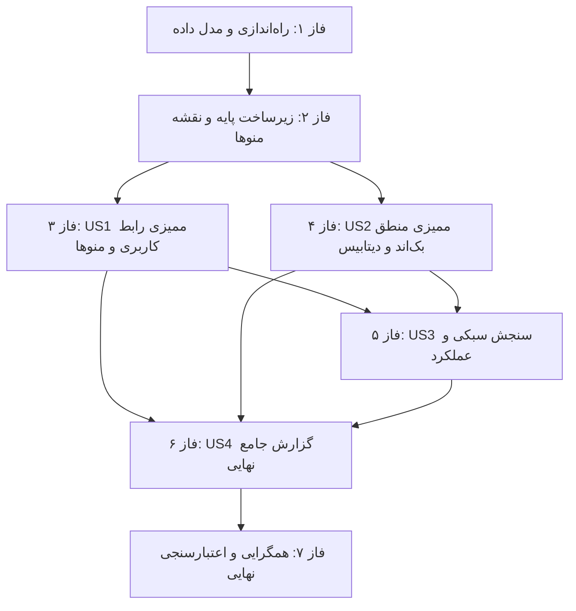

# فهرست وظایف اجرایی: ممیزی جامع کیفیت و تست سرتاسری منوها (Tasks: 002-full-app-qa-audit)

**ورودی**: اسناد طراحی از مسیر `/specs/002-full-app-qa-audit/`  
**پیش‌نیازها**: `plan.md` (الزامی)، `spec.md` (الزامی)، `data-model.md`، `contracts/`، `research.md`  

## ساختار کد تسک‌ها: `[ID] [P?] [Story/Phase] شرح تسک`
- **[P]**: تسک‌های موازی (فایل‌های مجزا بدون وابستگی متقابل).
- **[Story]**: انتساب به داستان‌های کاربری ([US1], [US2], [US3], [US4]).
- **مسیر فایل‌ها**: مسیر دقیق هر فایل در توضیحات تسک درج شده است.

---

## فاز ۱: راه‌اندازی و مدل داده ممیزی (Phase 1: Setup & Data Structures)
**هدف**: ایجاد ساختارها و تایپ‌های مشترک ارزیابی کیفی سامانه بر اساس `data-model.md`

- [x] T001 تعریف تایپ‌های TypeScript ارزیابی منوها و شاخص‌های کیفی در `src/types/qa-audit.ts`
- [x] T002 [P] ایجاد ماژول کمکی ثبت و ارزیابی سلامت اتصالات دیتابیس در `src/lib/audit-sanity.ts`

---

## فاز ۲: زیرساخت پایه و اعتبارسنجی اتصال (Phase 2: Foundational Prerequisites)
**هدف**: اعتبارسنجی اولیه اتصال پایگاه داده SQLite/Prisma و استخراج نقشه ۲۰ منو

- [x] T003 [P] استخراج رجیستری کامل ۲۰ مسیر و کلیدهای مجوز در `src/lib/menu-audit-registry.ts`
- [x] T004 [P] اجرای آزمون اولیه سلامت اتصال پایگاه داده و اسکیماها با دستور `npm run test:run -- src/lib/__tests__/perms.test.ts src/lib/__tests__/validations.test.ts`

---

## فاز ۳: داستان کاربری ۱ - ممیزی سیستماتیک منو به منو و ارزیابی رابط کاربری و RTL (Phase 3: User Story 1 — 🎯 MVP)
**هدف**: بازرسی ترتیبی و تفکیک‌شده تک‌تک ۲۰ منوی سامانه، بررسی چیدمان راست‌چین (`dir="rtl"` و کلاس‌های `ms-*`, `me-*`)، تایپوگرافی وزیرمتن و روانی تعاملات فرانت‌اند

### آزمون‌های داستان کاربری ۱ (Playwright E2E & Web-First Assertions)
- [x] T005 [P] [US1] تدوین سناریوی تست پیمایش خودکار ۲۰ منوی سیستم با Web-First Assertions در `e2e/desktop/tests/002-menu-navigation-audit.spec.ts`

### بازرسی عملیاتی و ارزیابی رابط کاربری
- [x] T006 [P] [US1] ارزیابی رابط کاربری منوهای پایانه و مانورها (`/depot`, `/dashboard`, `/manovrs/approvals`, `/manovrs`, `/manovrs/new`)
- [x] T007 [P] [US1] ارزیابی رابط کاربری منوهای مدیریت ناوگان و خطوط (`/trains`, `/lines`) و بازخورد مودال‌ها
- [x] T008 [P] [US1] ارزیابی رابط کاربری منوهای پرسنل و دسترسی‌ها (`/users`, `/roles`, `/phonebook`, `/profile`, `/tickets`)
- [x] T009 [P] [US1] ارزیابی رابط کاربری منوهای گزارش‌ساز، راهنما، تنظیمات تم و ماژول‌های ادمین (`/reports`, `/help`, `/settings`, `/admin/terminals`, `/admin/lookups`, `/admin/branding`, `/admin/audit`, `/admin/backup`)

**نقطه بازرسی**: در این مرحله کلیه ۲۰ منوی سیستم باز شده و سلامت ظاهری، چیدمان RTL و بازخوردهای تعاملی آن‌ها تایید می‌شود.

---

## فاز ۴: داستان کاربری ۲ - اعتبارسنجی منطق بک‌اند و اتصال پایگاه داده (Phase 4: User Story 2 — 🎯 MVP)
**هدف**: آزمون رفتار لایه‌های منطقی سرور (Server Actions)، اعتبارسنجی Zod، گارد امنیتی `hasPerm` و اثبات پایداری در پایگاه داده (Persistence Proof)

### آزمون‌های منطق سرور و اعتبارسنجی Zod
- [x] T010 [P] [US2] آزمون اعتبارسنجی داده‌ها و گارد hasPerm در اکشن‌های مانور در `src/app/actions/__tests__/manovr-actions.test.ts`
- [x] T011 [P] [US2] آزمون اعتبارسنجی داده‌ها و عملیات CRUD در اکشن‌های ناوگان و کاربران در `src/app/actions/__tests__/user-actions.test.ts`
- [x] T012 [P] [US2] آزمون اعتبارسنجی و مهار خطای اکشن‌های گزارش‌گیری و تیکت‌ها در `src/app/actions/tickets.ts` و `src/app/actions/scheduled-report.ts`

### اثبات پایداری پایگاه داده (Persistence Proof & Concurrency)
- [x] T013 [US2] راستی‌آزمایی پایداری تراکنش‌ها و سلامت همزمانی پایگاه داده در `src/lib/__tests__/terminal-stress-concurrency.test.ts`

**نقطه بازرسی**: در این مرحله عملکرد منطقی بک‌اند و اتصال مطمئن به پایگاه داده بدون نشت خطا یا مغایرت اثبات می‌گردد.

---

## فاز ۵: داستان کاربری ۳ - سنجش چابکی، سبکی و آزمون‌های تشخیصی (Phase 5: User Story 3 — Lightness & Diagnostics)
**هدف**: اندازه‌گیری سرعت بارگذاری، سبکی المان‌های بصری و اجرای آزمون‌های تشخیصی روی نقاط گلوگاه

- [x] T014 [P] [US3] سنجش زمان بارگذاری اولیه و تاخیر رندر منوها در `e2e/desktop/tests/002-performance-audit.spec.ts`
- [x] T015 [P] [US3] آزمون تشخیصی سبکی و روانی رندر گرافیکی نقشه پایانه در `src/lib/__tests__/terminal-2d-map.test.ts`
- [x] T016 [US3] آزمون تشخیصی رفتار سیستم در تعویض سریع منوها و عدم بروز فریز در `src/app/(main)/layout.tsx`

---

## فاز ۶: داستان کاربری ۴ - تدوین و استخراج گزارش جامع نهایی ممیزی (Phase 6: User Story 4 — Comprehensive Audit Report)
**هدف**: تجمیع داده‌های ممیزی ۲۰ منو و ۴ لایه معماری در قالب سند رسمی گزارش کیفیت پایانه مطابق با `contracts/audit-report-schema.json`

- [x] T017 [P] [US4] ساخت موتور تجمیع و ساختارمندسازی نتایج ممیزی در `src/lib/qa-report-generator.ts`
- [x] T018 [US4] تدوین و صدور گزارش نهایی ممیزی کیفیت و وضعیت لایه‌های سامانه در `specs/002-full-app-qa-audit/qa-audit-report.md`

---

## فاز ۷: تطابق سه‌گانه و همگرایی نهایی (Phase 7: Tri-Sync Verification & Convergence)
**هدف**: بررسی گیت‌های قانون اساسی، راستی‌آزمایی سه‌گانه آموزش و صدور گواهی همگرایی

- [x] T019 [P] ارزیابی آموزش‌های مرکز راهنما برای ۲۰ منو در `src/lib/__tests__/help-navigation.test.ts` با تضمین سقف حداقل ۱۰۰۰ کاراکتر فارسی
- [x] T020 اجرای کلیه آزمون‌های خودکار سامانه با دستور `npm run test:run`
- [x] T021 اجرای فرمان `/speckit-converge` جهت ثبت سند همگرایی و تایید نهایی

---

## ترتیب وابستگی‌ها (Dependency Graph)

## نمونه‌های اجرای موازی (Parallel Execution Opportunities)
- **در فاز ۳**: تسک‌های T006, T007, T008, T009 به صورت مستقل روی گروه‌های مختلف منوها قابل اجرا هستند.
- **در فاز ۴**: تسک‌های T010, T011, T012 روی ماژول‌های مجزای اکشن‌های سرور موازی هستند.
- **در فاز ۵**: تسک‌های T014 و T015 به طور موازی سناریوهای کارایی را می‌سنجند.

## راهبرد تحویل تدریجی (Incremental Strategy)
- **محدوده MVP اولیه**: تکمیل فازهای ۱، ۲ و ۳ (تسک‌های T001 تا T009) که ممیزی کامل ۲۰ منو و رابط کاربری را محقق می‌سازد.
- **تکمیل جامع**: اجرای فازهای ۴، ۵ و ۶ جهت ممیزی لایه‌های منطقی، پایگاه داده، عملکرد و تدوین گزارش رسمی.
