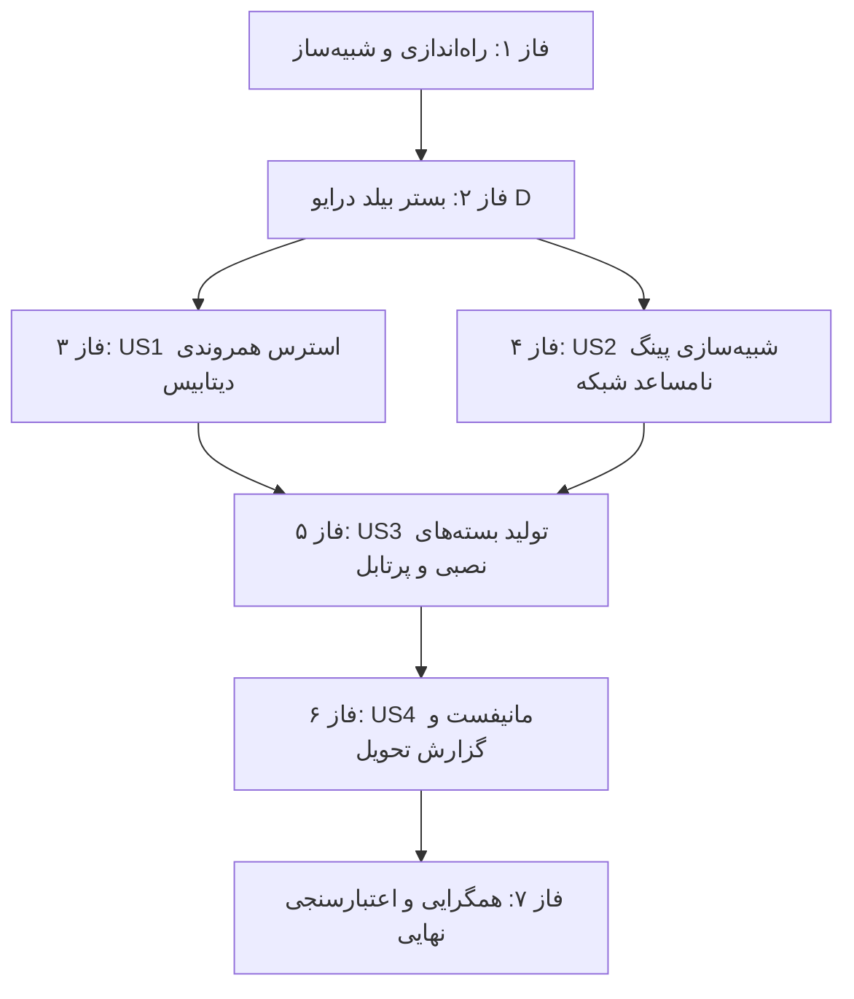

# فهرست وظایف اجرایی: بسته‌بندی توزیع، آزمون استرس و شبیه‌سازی شبکه (Tasks: 003-packaging-network-resilience)

**ورودی**: اسناد طراحی از مسیر `/specs/003-packaging-network-resilience/`  
**پیش‌نیازها**: `plan.md` (الزامی)، `spec.md` (الزامی)، `data-model.md`، `contracts/`، `research.md`  

## ساختار کد تسک‌ها: `[ID] [P?] [Story/Phase] شرح تسک`
- **[P]**: تسک‌های موازی (فایل‌های مجزا بدون وابستگی متقابل).
- **[Story]**: انتساب به داستان‌های کاربری ([US1], [US2], [US3], [US4]).
- **مسیر فایل‌ها**: مسیر دقیق هر فایل در توضیحات تسک درج شده است.

---

## فاز ۱: راه‌اندازی و زیرساخت شبیه‌ساز (Phase 1: Setup & Simulation Infrastructure)
**هدف**: تعریف ساختارهای داده، اسکیماهای مانیفست و اسکریپت شبیه‌ساز تاخیر شبکه

- [x] T001 تعریف تایپ‌های TypeScript شبیه‌ساز شبکه و مانیفست توزیع در `src/types/distribution.ts`
- [x] T002 [P] ایجاد ماژول شبیه‌ساز پوشه شبکه مجازی با تاخیر مصنوعی در `scripts/simulate-network.js`

---

## فاز ۲: پیش‌نیازها و بستر بیلد درایو D (Phase 2: Foundational Prerequisites)
**هدف**: آماده‌سازی دایرکتوری‌های بیلد، جلوگیری از خطای ENOSPC درایو C و اعتبارسنجی صف نوبت‌دهی دیتابیس

- [x] T003 [P] اطمینان از تنظیم دایرکتوری‌های `D:/manovr-build-dist` و `D:/manovr-temp` در `scripts/build.js`
- [x] T004 [P] اعتبارسنجی اولیه صف نوبت‌دهی دیتابیس با دستور `npm run test:run -- src/lib/__tests__/prisma-concurrency.test.ts src/lib/__tests__/terminal-stress-concurrency.test.ts`

---

## فاز ۳: داستان کاربری ۱ - ارزیابی سرعت لود و آزمون استرس همروندی دیتابیس (Phase 3: User Story 1 — 🎯 MVP)
**هدف**: اطمینان از استارت‌آپ فوق‌سریع، اجرای آزمون فشار همزمانی چندکاربره و اثبات عدم وجود خطای قفل دیتابیس (`SQLITE_BUSY`)

- [x] T005 [P] [US1] تدوین سناریوی آزمون استرس همزمانی خواندن و نوشتن چندکاربره در `src/lib/__tests__/network-sim-concurrency.test.ts`
- [x] T006 [US1] اجرای آزمون فشار همروندی دیتابیس و اثبات پایداری داده‌ها (Persistence Proof) بدون خطای قفل
- [x] T007 [US1] اندازه‌گیری زمان باز شدن اولیه نرم‌افزار و بهینه‌سازی بارگذاری سرور مستقل در `main.js` و `splash.html`

**نقطه بازرسی**: در این مرحله پایداری کامل دیتابیس تحت بار چندکاربره همزمان و سرعت باز شدن برنامه تایید می‌گردد.

---

## فاز ۴: داستان کاربری ۲ - شبیه‌سازی پوشه شبکه مجازی با پینگ نامساعد (Phase 4: User Story 2 — 🎯 MVP)
**هدف**: استقرار دیتابیس در پوشه شبکه شبیه‌سازی‌شده با تاخیر مصنوعی بالا (۱۰۰ms تا ۸۰۰ms) و اثبات تاب‌آوری صف بازتلاش

- [x] T008 [P] [US2] راه‌اندازی پوشه شبکه مجازی در مسیر `tests/virtual-network-share/` و شبیه‌سازی تاخیر تصادفی پینگ با Jitter
- [x] T009 [US2] اتصال کلاینت آزمایشی به پوشه شبکه مجازی و ارسال تراکنش‌های همزمان مانور در شرایط پینگ ضعیف
- [x] T010 [US2] راستی‌آزمایی عملکرد صف نوبت‌دهی (Retry Queue) کلاینت Prisma در `src/lib/prisma.ts` و اثبات عدم کرش سیستم

**نقطه بازرسی**: سیستم در بدترین شرایط پینگ شبکه محلی به درستی عمل کرده و بدون از دست رفتن داده پاسخ می‌دهد.

---

## فاز ۵: داستان کاربری ۳ - تولید بسته‌های توزیع: نصبی، پرتابل، اکسترکت‌شده و آموزش (Phase 5: User Story 3 — 🎯 MVP)
**هدف**: اجرای خط لوله بیلد الکترون و استخراج همزمان هر ۳ قالب اجرایی به همراه فایل آموزش جامع

- [x] T011 [P] [US3] به‌روزرسانی اسکریپت `scripts/build.js` و `electron-builder.yml` جهت تولید تارگت‌های nsis, portable و dir
- [x] T012 [US3] اجرای کامپایل سرور مستقل Next.js با دستور `npm run build`
- [x] T013 [US3] اجرای خط تولید الکترون جهت ساخت بسته نصبی `ManovrSystem-Setup.exe` در `D:/manovr-build-dist/`
- [x] T014 [US3] اجرای خط تولید الکترون جهت ساخت فایل پرتابل `ManovrSystem-Portable.exe` در `D:/manovr-build-dist/`
- [x] T015 [US3] تولید دایرکتوری اکسترکت‌شده نصبی `win-unpacked/` در `D:/manovr-build-dist/`
- [x] T016 [P] [US3] نگارش و الحاق فایل مستندات و آموزش جامع پایانه و راهنمای استقرار در شبکه (`USER_GUIDE.md`) درون پوشه خروجی

**نقطه بازرسی**: کلیه فایل‌های خروجی درخواستی کارفرما در پوشه توزیع موجود، سالم و قابل اجرا هستند.

---

## فاز ۶: داستان کاربری ۴ - تدوین گزارش تاییدیه عملکرد و مانیفست تحویل (Phase 6: User Story 4 — Delivery Report)
**هدف**: ثبت مانیفست دیجیتال بسته‌ها و تدوین گزارش رسمی تاییدیه تحویل

- [x] T017 [P] [US4] تولید مانیفست دیجیتال بسته‌های توزیع در `D:/manovr-build-dist/distribution-manifest.json` مطابق با `contracts/packaging-manifest-schema.json`
- [x] T018 [US4] تدوین گزارش تاییدیه استرس همروندی، شبیه‌سازی پینگ شبکه و اقلام تحویل در `specs/003-packaging-network-resilience/release-report.md`

---

## فاز ۷: اعتبارسنجی سه‌گانه، تست‌های رگرسیون و همگرایی (Phase 7: Tri-Sync Verification & Convergence)
**هدف**: ارزیابی ۷ گیت قانون اساسی، تایید ۱۰۰٪ آزمون‌ها و اعلام همگرایی رسمی

- [x] T019 [P] اجرای آزمون ناوگانی و ناوبری مرکز آموزش در `src/lib/__tests__/help-navigation.test.ts` با تایید سقف حداقل ۱۰۰۰ کاراکتر فارسی
- [x] T020 اجرای کلیه آزمون‌های خودکار سامانه با دستور `npm run test:run`
- [x] T021 اجرای فرمان `/speckit-converge` جهت ثبت سند همگرایی و تایید نهایی قابلیت

---

## ترتیب وابستگی‌ها (Dependency Graph)

## نمونه‌های اجرای موازی (Parallel Execution Opportunities)
- **در فاز ۳ و ۴**: آزمون‌های استرس همروندی (T005) و شبیه‌ساز پوشه شبکه (T008) می‌توانند به صورت موازی توسعه یابند.
- **در فاز ۵**: آماده‌سازی مستندات آموزش (T016) همزمان با فرآیند بیلد الکترون قابل انجام است.

## راهبرد تحویل تدریجی (Incremental Delivery)
- **محدوده MVP اولیه**: فازهای ۱ تا ۵ (اجرای آزمون‌های استرس، شبیه‌ساز پینگ بالا و تولید قطعی فایل‌های نصبی، پرتابل، اکسترکت‌شده و آموزش).
- **تکمیل نهایی**: فازهای ۶ و ۷ (استخراج مانیفست رسمی و ثبت تاییدیه همگرایی).
