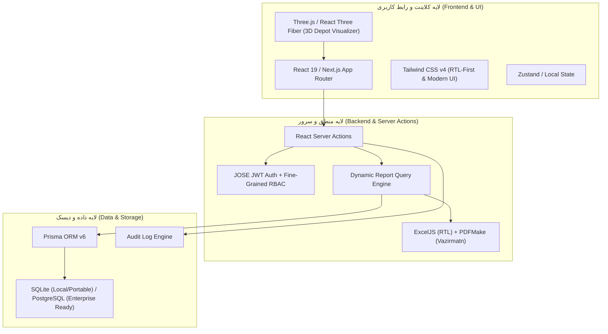

# سند جامع معرفی، خصوصیات فنی و نیازمندی‌های زیرساختی سامانه مدیریت مانور و پایانه (Manovr System)

این مستند جهت ارائه رسمی به **کارفرما و مدیران ارشد پروژه** تدوین شده است تا دیدگاه جامعی از قابلیت‌ها، معماری نرم‌افزاری، گزینه‌های استقرار و نیازمندی‌های سخت‌افزاری سامانه فراهم آورد.

---

## ۱. معرفی و اهداف سامانه (Executive Overview)

سامانه جامع **Manovr** یک نرم‌افزار تخصصی مدیریت عملیات پایانه، خطوط ریل، ناوگان قطارها و مانورهای جابه‌جایی در پایانه‌های قطار شهری (مترو) است. هدف اصلی این سامانه دیجیتال‌سازی، پایش آنلاین، کاهش خطاهای انسانی و هوشمندسازی گزارش‌گیری عملیات پایانه می‌باشد.

### اهداف اصلی پروژه:
* **ثبت و پایش زنده مانورها**: جایگزینی فرم‌ها و ثبت‌های دستی با ثبت آنلاین جابه‌جایی قطارها، راهبرها و مسئولین شیفت.
* **مدیریت خطوط و ظرفیت سوله‌ها**: نمایش زنده و گرافیکی وضعیت پارک قطارها روی خطوط، خطوط مسدود یا در دست تعمیر.
* **کنترل ناوگان و شناسه فنی قطارها**: ثبت وضعیت فنی (کفشک، ATP، موعد دوار، مجوزها) و وضعیت آماده‌به‌کار قطارها.
* **شفافیت عملیاتی و گزارش‌گیری پویا**: تولید گزارش‌های رسمی تحلیلی، خروجی اکسل راست‌چین و PDF فارسی جهت ارزیابی کارایی شیفت‌ها.

---

## ۲. احصای کامل قابلیت‌ها و امکانات (Features & Modules)

### 🔹 الف) ماژول مدیریت مانورها (Maneuver Management)
* **ثبت مانور جدید**: ثبت سریع نوع مانور (اعزام، دیزل، شستشو، تعمیرات و...) به همراه قطار، خط مبدأ، خط مقصد، راهبر ۱ و راهبر ۲.
* **گردش کار تأیید و پایان**: مدیریت وضعیت مانور (در حال اجرا، خاتمه‌یافته، تأییدشده یا ردشده توسط مسئول شیفت).
* **تاریخچه و جستجوی پیشرفته**: قابلیت فیلتر بر اساس شیفت، تاریخ، نوع مانور، راهبر و قطار.

### 🔹 ب) ماژول نمای گرافیکی و سه‌بعدی پایانه (2D & 3D Depot View)
* **نمای ۲بعدی وکتور (2D Layout)**: نقشه شفاف و سبک خطوط سوله با نمایش جانمایی قطارها روی خطوط به همراه کد و وضعیت فنی.
* **نمای ۳بعدی تعاملی (3D WebGL / Three.js)**: مشاهده سه‌بعدی سوله و ناوگان با بهینه‌سازی Low-Poly (قابلیت چرخش، زوم، جابه‌جایی و کلیک روی قطارها).

### 🔹 ج) ماژول قطارها و ناوگان (Train Fleet Management)
* ثبت انواع ناوگان: قطارهای AC (برقی نسل جدید)، DC (برقی نسل قدیم) و دیزل (لوکوموتیو مانوری).
* پایش وضعیت فنی قطار: داشتن/نداشتن کفشک، وضعیت سیستم ATP، موعد دوار (A, B, C)، مجوز حرکت و وضعیت آماده به کار/تعمیرات.

### 🔹 د) دفتر تلفن و دایرکتوری پرسنل (Phonebook & Personnel Directory)
* ثبت دایرکتوری تماس پرسنل شیفت‌ها و سمت‌های سازمانی مختلف.
* **امکان ثبت مخاطبان مستقل**: قابلیت ثبت، ویرایش کامل و حذف شماره تلفن افراد بدون نیاز به ایجاد حساب کاربری/لاگین در سایت.
* جستجوی سریع هوشمند، کپی یک‌کلیکه شماره‌ها، خروجی اکسل RTL و ورود دسته‌جمعی از فایل اکسل.

### 🔹 هـ) سیستم گزارش‌ساز پویا و زمان‌بندی (Dynamic Report Builder & Scheduler)
* **گزارش‌ساز کشویی و پویای شرطی**: امکان انتخاب فیلدهای دلخواه، شرط‌های فیلترینگ پیچیده، گروه‌بندی و نمودارها.
* **خروجی اکسل راست‌چین (RTL Excel)**: تولید فایل اکسل کاملاً استاندارد مطابق با حروف‌چینی فارسی.
* **خروجی PDF رسمی**: خروجی PDF به همراه فونت فارسی وزیرمتن (Vazirmatn) تعبیه‌شده بدون به هم ریختگی فونت.
* **گزارش‌های زمان‌بندی‌شده (Scheduled Reports)**: تولید و ارسال خودکار گزارش‌های دوره‌ای.

### 🔹 و) پشتیبانی و تیکتینگ داخلی (Internal Ticketing System)
* امکان ثبت درخواست‌ها، گزارش خرابی و پیشنهادات توسط پرسنل شیفت برای مدیران سامانه به همراه تاریخچه گردش تیکت.

### 🔹 ز) مدیریت سیستم، امنیت و لاگ وقایع (Admin Panel, Audit & Security)
* **کنترل دسترسی ریز (Fine-Grained RBAC)**: تعریف نقش‌های سفارشی با مجوزهای مجزا (مثل `manovr.create`, `phonebook.edit`, `report.export`).
* **ثبت کامل وقایع (Audit Log)**: ثبت تمام تغییرات، ایجاد و حذف رکوردهای سیستم توسط کاربران به همراه شناسه و جزئیات.
* **مدیریت پشتیبان‌گیری (Backup & Restore)**: گرفتن نسخه پشتیبان دستی و زمان‌بندی‌شده از پایگاه داده و فایل‌ها با حجم فشرده.
* **مدیریت مقادیر پویا (Lookups)**: ویرایش کدهای عددی، عناوین فارسی و رنگ نشانگرهای انواع مانور، ترمینال‌ها و سمت‌ها.

---

## ۳. مرزهای عملکردی سیستم (System Boundaries - چه کارهایی انجام نمی‌دهد)

برای شفافیت کامل با کارفرما، مرزهای زیر برای این نرم‌افزار تعریف شده است:
1. **عدم کنترل مستقیم سخت‌افزاری سوزن ریل (No Direct PLC Hardware Actuation)**: سامانه یک نرم‌افزار پایش، مدیریت و ثبت عملیاتی (Operational Management & Monitoring) است و سوزن‌های فیزیکی ریل را به‌صورت اتوماتیک تغییر نمی‌دهد (کنترل سوزن بر عهده سیستم سیگنالینگ/سخت‌افزار ریل است).
2. **استقلال از اینترنت عمومی (100% Offline Capable)**: سامانه نیازمند اینترنت نیست و تمام فونت‌ها، کتابخانه‌ها و دیتابیس آن به‌صورت محلی (Local) بارگذاری می‌شوند تا بالاترین امنیت پدافند غیرعامل در تاسیسات حساس رعایت شود.
3. **عدم ارسال مستقیم SMS بدون سخت‌افزار داخلی**: در صورت نیاز به پیامک، نیازمند متصل شدن به پنل‌های سازمانی یا مودم GSM محلی خواهد بود.

---

## ۴. معماری فنی و تکنولوژی‌های مورد استفاده (Tech Stack & Architecture)

معماری نرم‌افزار بر اساس آخرین استانداردهای توسعه وب و دسکتاپ مدرن در سال ۲۰۲۶ طراحی شده است:

### مشخصات دقیق تکنولوژی‌ها:
| لایه / بخش | تکنولوژی / کتابخانه | توضیحات و ویژگی‌ها |
| :--- | :--- | :--- |
| **فریم‌ورک اصلی** | **Next.js 16 (App Router)** | فریم‌ورک قدرتمند Full-Stack مبتنی بر React 19 با عملکرد بسیار بالا |
| **زبان برنامه‌نویسی** | **TypeScript 5** | کدنویسی تایپ-امپراتوری جهت جلوگیری از خطاهای زمان اجرا (Strict Mode) |
| **طراحی و استایل** | **Tailwind CSS v4** | رابط کاربری مدرن، تم تاریک/روشن، شیشه‌ای (Glassmorphism)، کاملاً راست‌چین |
| **پایگاه داده & ORM** | **Prisma ORM + SQLite / Postgres** | دیتابیس سبک و صفر-پیکربندی SQLite (قابل ارتقا به PostgreSQL تنها با تغییر کانفیگ) |
| **نمای ۳بعدی** | **Three.js & React Three Fiber** | رندرینگ سه‌بعدی لایت سوله و قطارها با استفاده از شتاب‌دهنده سخت‌افزاری وب (WebGL) |
| **تولید گزارش و فایل** | **ExcelJS + pdfmake** | تولید اکسل متناسب با فرمت RTL و تولید PDF فارسی با فونت Vazirmatn |
| **بسته‌بندی دسکتاپ** | **ElectronJS (v43)** | قابلیت خروجی مستقیم فایل اجرایی Windows (خروجی `.exe` مستقل) |

---

## ۵. سناریوهای استقرار و محیط‌های اجرای پیشنهادی (Deployment Options)

نرم‌افزار به‌گونه‌ای طراحی شده که با توجه به نیاز کارفرما به **سه روش مختلف** قابل نصب و اجراست:

### 🖥️ سناریو اول: سرور تحت شبکه داخلی پایانه (Intranet Web Server - پیشنهاد اصلی)
در این حالت، نرم‌افزار روی یک سرور مرکزی در اتاق کنترل یا دیتاسنتر پایانه نصب می‌شود و تمام پرسنل (مسئولین شیفت، راهبرها، مدیران) از طریق مرورگر وب (Chrome/Edge/Firefox) سیستم یا تبلت خود به آن متصل می‌شوند.
* **مزایا**: دسترسی همزمان چندین کاربر، مدیریت متمرکز دیتابیس، عدم نیاز به نصب نرم‌افزار روی تک‌تک رایانه‌ها.

### 💻 سناریو دوم: برنامه دسکتاپ مستقل (Standalone Executable - `.exe`)
نرم‌افزار به صورت یک فایل نصب‌کننده یا پرتابل Windows (توسط Electron) خروجی گرفته می‌شود و مستقیماً روی رایانه مسئول شیفت نصب می‌گردد.
* **مزایا**: عدم نیاز به هیچ‌گونه سرور، دیتابیس مجزا یا نصب Node.js (همه پیش‌نیازها در فایل `.exe` قرار دارند).

### ☁️ سناریو سوم: استقرار ابری / دیتاسنتر مرکزی (Enterprise Cloud / Docker Container)
نصب در قالب Docker Container روی زیرساخت‌های ابری یا دیتاسنتر مرکزی سازمان قطار شهری با پایگاه داده PostgreSQL.

---

## ۶. نیازمندی‌های سخت‌افزاری و شبکه (Hardware & System Requirements)

جهت پیشنهاد به کارفرما برای تامین زیرساخت، جدول زیر مشخصات پیشنهادی را ارائه می‌دهد:

### الف) نیازمندی‌های سرور (برای سناریو سرور وب داخلی / Intranet)
| منبع سخت‌افزاری | حداقل سیستم مورد نیاز | سیستم پیشنهادی (خوب) | سیستم ایده‌آل (عالی) |
| :--- | :--- | :--- | :--- |
| **پردازنده (CPU)** | 2 Cores (Intel Core i3 / Xeon) | 4 Cores (Intel Core i5 / Xeon) | 8 Cores (Intel Core i7 / Xeon) |
| **حافظه اصلی (RAM)** | 4 GB | 8 GB | 16 GB |
| **فضای ذخیره‌سازی** | 20 GB SSD | 50 GB NVMe SSD | 100 GB NVMe SSD |
| **سیستم‌عامل** | Windows 10/11 یا Ubuntu 22.04 LTS | Windows Server 2022 یا Ubuntu 24.04 | Ubuntu Server 24.04 LTS / Debian 12 |
| **شبکه** | کارت شبکه 100Mbps (شبکه داخلی سوله) | کارت شبکه 1Gbps | کارت شبکه 1Gbps دوگانه (Redundant) |

### ب) نیازمندی‌های کلاینت (رایانه کاربران یا حالت دسکتاپ `.exe`)
* **پردازنده**: Intel Core i3 یا معادل آن
* **رم**: 4 گیگابایت
* **مرورگر**: مرورگرهای مدرن (Google Chrome 100+، Microsoft Edge، Mozilla Firefox)
* **کارت گرافیک**: هر نوع کارت گرافیک مجهز به پشتیبانی از WebGL (حتی گرافیک‌های آنبورد Intel HD Graphics برای نمای ۳بعدی).

---

## ۷. چک‌لیست اقدامات جهت تحویل به کارفرما

برای راه‌اندازی و تحویل نهایی نرم‌افزار به کارفرما، مراحل زیر پیشنهاد می‌شود:

1. **تعیین سناریوی استقرار**: تصمیم‌گیری بین حالت **سرور شبکه داخلی (Web)** یا **نرم‌افزار دسکتاپ (.exe)**.
2. **تأمین سرور/رایانه**: سفارش یک دستگاه سرور یا کلاینت با مشخصات فوق (رم 8GB، SSD 50GB).
3. **پیکربندی شبکه محلی**: اختصاص یک IP ثابت (Static IP) در شبکه داخلی پایانه برای دسترسی آسان پرسنل (مثلاً `http://192.168.1.100:3000`).
4. **تعریف کاربران و نقش‌های اولیه**: ورود اطلاعات پرسنل، شیفت‌ها (A, B, C) و تعیین مدیران سیستم.
